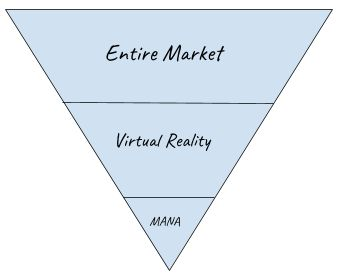
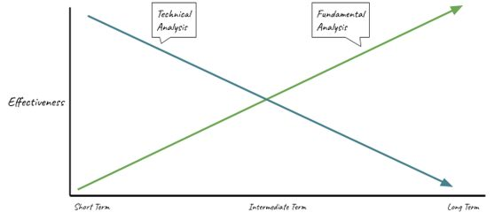

# Crypto Fundamental Analysis

> Sources: Alan John & Jon Law, 2021
> Raw: [Crypto Technical Analysis](../../raw/crypto/crypto-technical-analysis-your-one-stop-guide-to-investing-trading-and-profiting.md)

## Overview

Fundamental analysis (FA) in crypto examines the intrinsic value of a cryptocurrency through project-specific metrics rather than price action. Unlike stocks, where FA relies on revenue, profit, and cash flow, crypto FA evaluates on-chain data, token economics, development activity, and market fundamentals.

FA answers whether an asset is undervalued or overvalued relative to its true worth. The approach can be top-down (market → sector → project) or bottom-up (individual project → market context). FA is best paired with TA — use FA to identify what to buy and TA to determine when to buy.

## On-Chain Analysis

On-chain metrics measure activity directly from the blockchain ledger. These provide transparent, unfalsifiable data about network usage.

### Network Activity and Active Addresses

Active addresses count unique addresses participating in successful transactions within a timeframe. Rising active addresses alongside rising prices confirms organic demand. Divergence — price rising while active addresses fall — signals a potential top.

### Transaction Volume and Value

The total value and count of transactions on a network indicate real economic activity. High transaction volume relative to market cap suggests genuine utility. Spikes in large transactions (whale movements) often precede significant price moves.

### Hash Rate

Hash rate measures the computational power securing a proof-of-work network. A rising hash rate indicates growing miner commitment and network security. Bitcoin's hash rate has historically bottomed near price cycle lows.

### Exchange Flows

Deposits to exchanges suggest selling intent; withdrawals suggest accumulation. Miner deposits to exchanges can signal impending selling pressure. The ratio of exchange inflows to outflows is a widely watched sentiment indicator.

## Token Economics

Supply mechanics fundamentally determine a cryptocurrency's value trajectory through basic supply-and-demand dynamics.

### Supply Metrics

- **Circulating supply**: Coins currently available for trading.
- **Total supply**: All coins that exist, including locked or reserved amounts.
- **Maximum supply**: The hard cap on coins that can ever exist.

Bitcoin's fixed supply of 21 million makes it deflationary — as coins are lost or held long-term, each remaining coin becomes scarcer. Ethereum has no maximum supply but a fixed yearly issuance (18M ETH/year), meaning its inflation rate decreases over time as the total supply grows.

### Fixed vs Unlimited Supply

**Deflationary assets** (fixed supply like Bitcoin): Total supply shrinks over time through lost keys and burning, increasing the value of remaining units. **Inflationary assets** (unlimited supply like Ethereum): New coins enter circulation, diluting existing holders. However, fixed issuance becomes proportionally smaller as total supply grows, reducing inflation over time.

### Burning

Coins sent to inaccessible "eater addresses" are permanently removed from circulation, functioning like stock buybacks. Burning reduces circulating supply and can drive price upward through increased scarcity. Approximately 3 million Bitcoins have been permanently lost.

### Halving

Bitcoin halves its block reward every 210,000 blocks (~4 years), reducing the rate of new supply entering circulation. The reward dropped from 12.5 BTC to 6.25 BTC in May 2020. Historically, halving events precede major bull runs by reducing supply while demand continues growing.

## Valuation Metrics

### Network Value to Transactions (NVT) Ratio

NVT compares market capitalization to daily transaction volume. Similar to the price-to-earnings (P/E) ratio in stocks. A high NVT suggests the network is overvalued relative to its usage; a low NVT suggests undervaluation. NVT is most meaningful for payment-focused cryptocurrencies.

### Market Cap Dominance

Bitcoin dominance (BTC market cap / total crypto market cap) indicates capital rotation between Bitcoin and altcoins. Falling dominance suggests an altcoin season; rising dominance indicates flight to safety.

### Stock-to-Flow (S2F)

S2F measures scarcity by dividing existing stock by annual production. Bitcoin's S2F ratio has historically correlated with its market cap. The model predicts price increases following halving events as stock grows relative to new flow.

## Team and Development

The team behind a cryptocurrency is a critical fundamental factor, especially for long-term holds.

### Team Evaluation

Research the founding team's background, track record, and reputation. Look for teams with relevant industry experience and transparent communication. Examples: Storj's CEO Ben Golub (Northwestern professor, former Harvard instructor) and Cardano's management by three organizations (IOHK, Emgo, Cardano Foundation).

### Whitepapers

The whitepaper explains the project's problem, solution, technology, and roadmap. Three common types exist: backgrounders (technical explanation), numbered lists (digestible format), and problem/solution (identifying a problem and presenting the proposed solution). All professional projects have whitepapers, typically on their website.

### GitHub Activity and Developer Count

Active development signals a healthy, evolving project. Check commit frequency, number of developers, and the quality of code contributions. Abandoned repositories or declining developer activity are major red flags.

### Roadmap Progress

Evaluate whether the team meets stated milestones. Consistent delivery on roadmap promises indicates competent execution.

### Events

Upcoming launches, partnerships, airdrops, and forks provide trading catalysts. Event calendars (CoinMarketCal, CoinEvents, CoinCalendar) track these. Events weeks or months out are less likely to be priced in than imminent ones.

## Market Fundamentals

### Trading Volume

24-hour trading volume reflects liquidity and interest. Volume should be evaluated relative to market cap to assess whether the trading activity is proportional to the project's size. Bitcoin's daily volume is ~4% of market cap; smaller altcoins often trade much higher percentages.

### Exchange Listings

Listings on major exchanges (Binance, Coinbase, Kraken) increase accessibility and liquidity. New exchange listings frequently cause price pumps as more investors can access the asset.

### Liquidity Depth

Order book depth reveals the true liquidity of a market. Thin order books mean large trades cause significant slippage. Depth charts display the crossover point where buy and sell orders meet, indicating where trades execute efficiently.

## The Big-Brother Technique

A concept from crypto influencer Ivan on Tech: projects that offer a small twist on an already-popular "big brother" project often go parabolic. Investors are more willing to embrace familiar concepts with slight improvements than entirely novel ideas. Examples: Ethereum (like Bitcoin but with smart contracts), Cardano (like Ethereum but proof-of-stake), PancakeSwap (like Uniswap but lower fees on Binance Smart Chain).

## Combining FA with TA

Fundamental analysis identifies undervalued projects with strong fundamentals. Technical analysis then provides precise entry and exit timing. This combination — FA for selection, TA for execution — is the most robust approach to crypto trading. FA effectiveness increases over longer time horizons; TA effectiveness peaks over shorter periods.

## See Also

- [Crypto Technical Analysis](crypto-technical-analysis.md)
- [Crypto Hype Analysis](crypto-hype-analysis.md)
- [Blockchain Technology](blockchain-technology.md)
- [Cryptocurrency Fundamentals](crypto-fundamentals.md)
- [Volume Profile](../trading/volume-profile.md)
- [Order Flow and Footprint](../trading/order-flow-footprint.md)
- [Contrarian Sentiment Analysis](../trading/contrarian-sentiment-analysis.md)
## 🔗 Graph Connections

| Concept | Relation | Source |
|---|---|---|
| Crypto Supply Mechanisms | Component Of | EXTRACTED |
| Market Capitalization | Metric In | EXTRACTED |
| Technical Analysis | Contrasts With | EXTRACTED |
