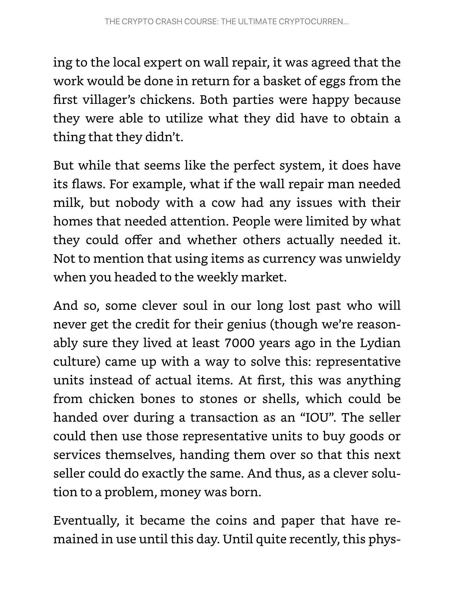
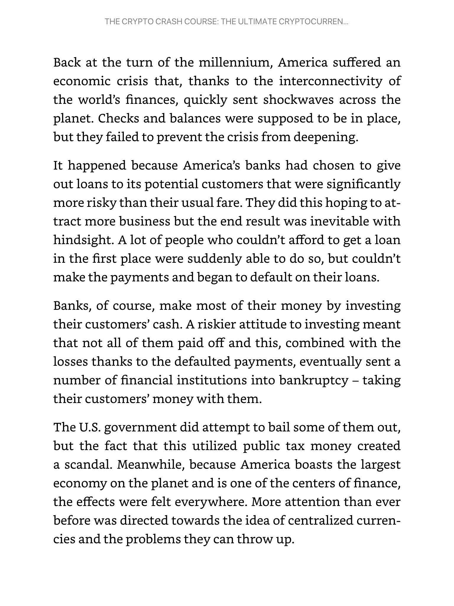
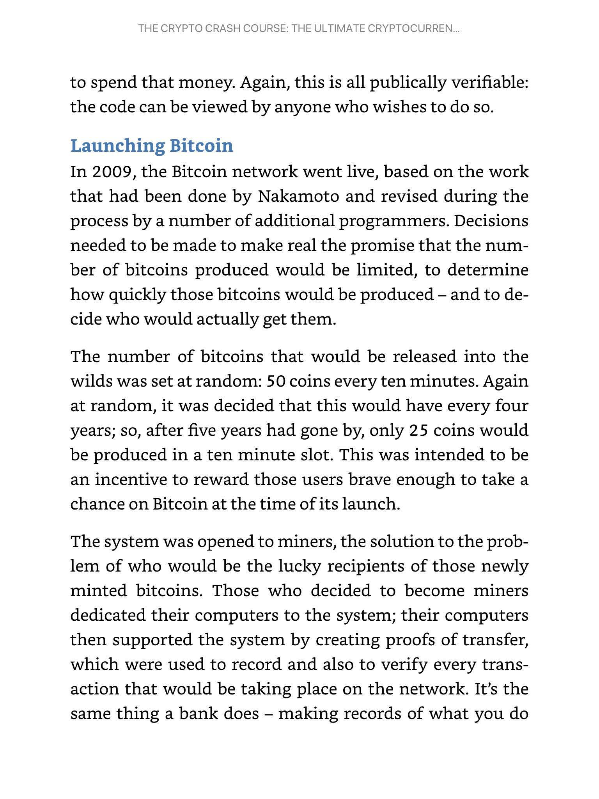
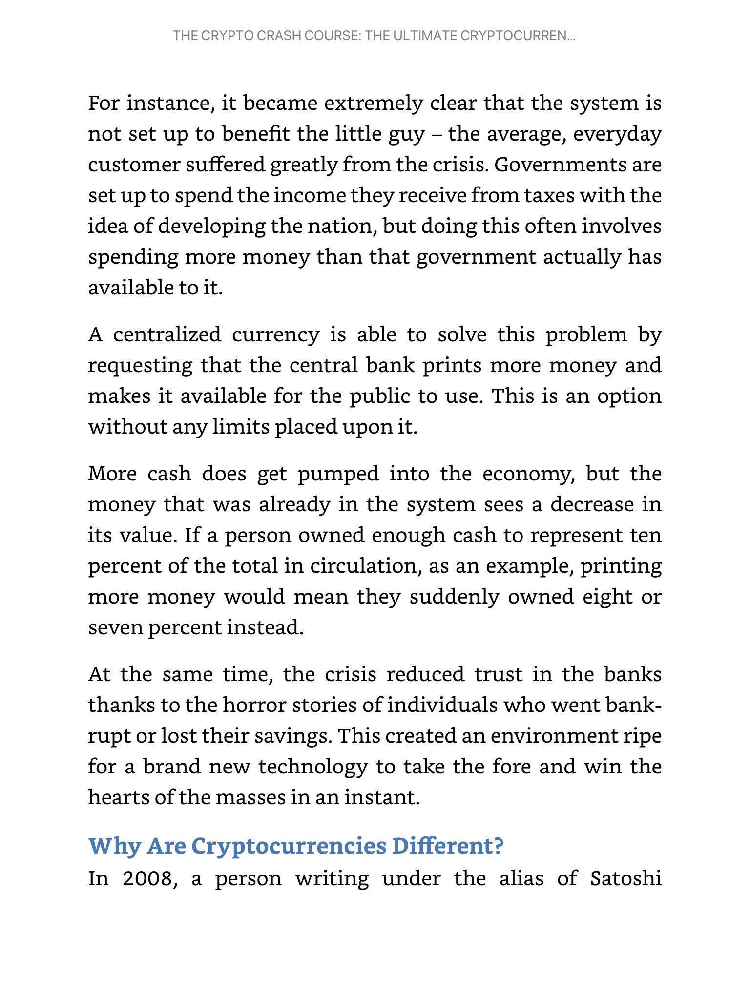
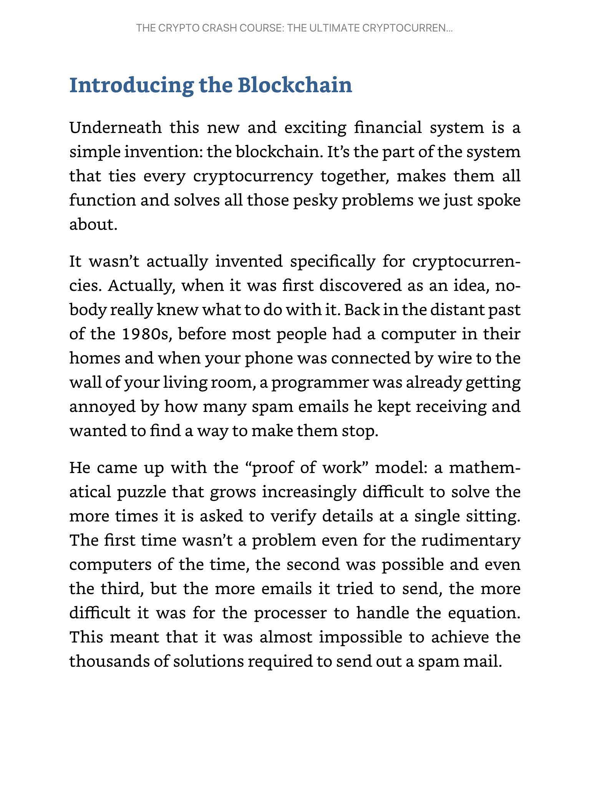
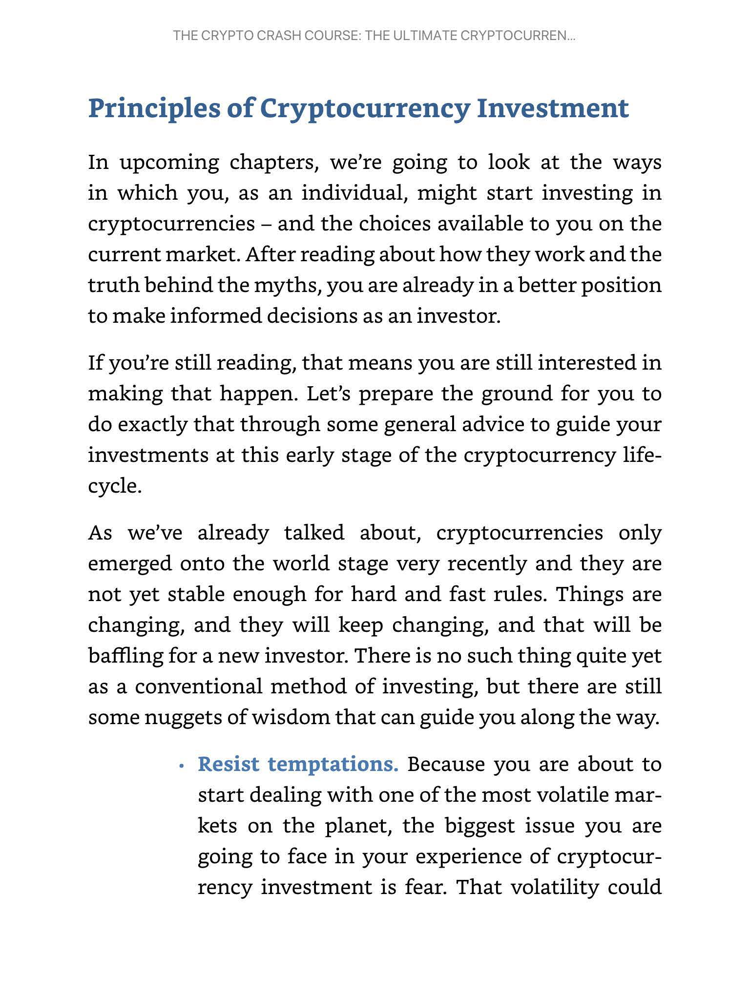
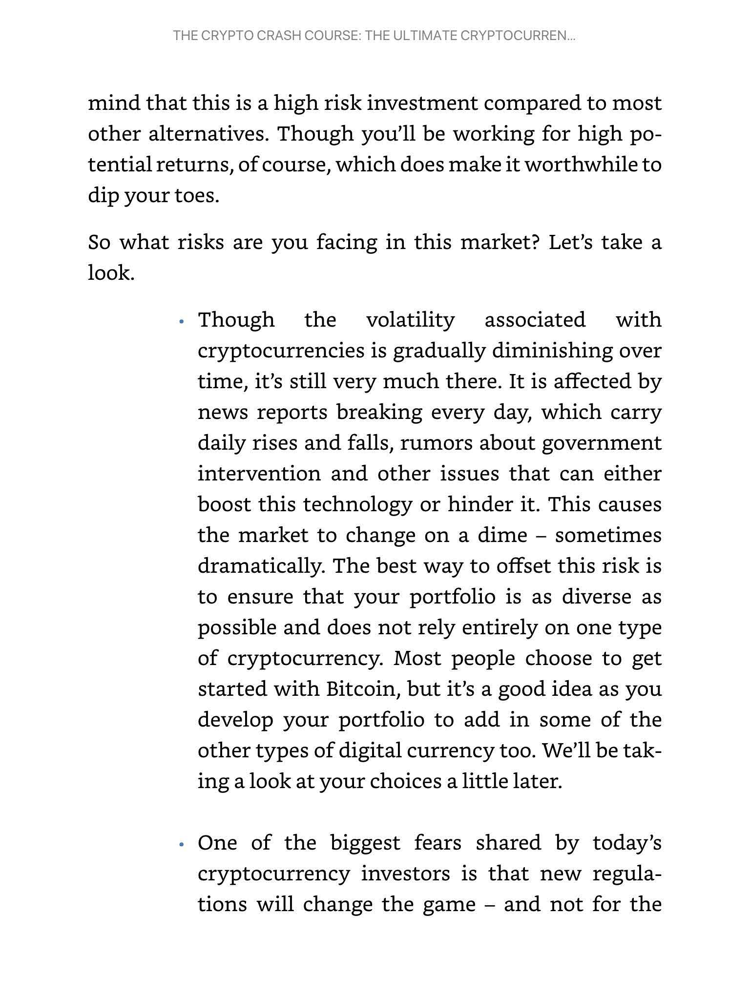
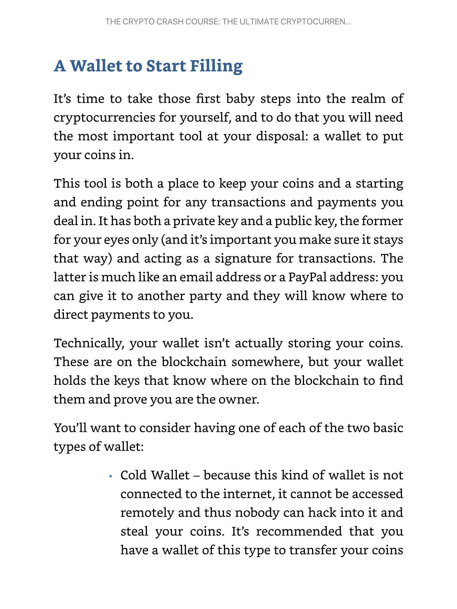
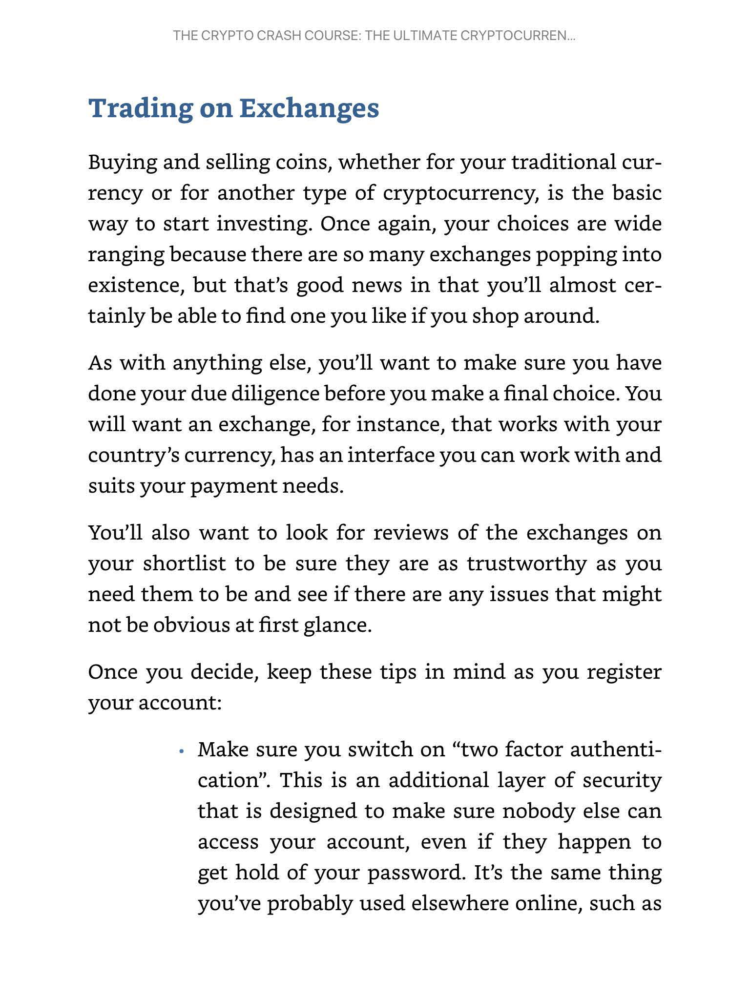

# Cryptocurrency Fundamentals

> Sources: Frank Richmond, 2018
> Raw: [Crypto Crash Course](../../raw/crypto-crash-course/2026-05-20-crypto-crash-course.md)

## Overview

A beginner-oriented overview of cryptocurrency fundamentals drawn from Frank Richmond's 2018 guide. Covers the history of money and why Bitcoin emerged after the 2008 financial crisis, how blockchain and proof-of-work create trust without central authorities, the trade-offs (volatility, regulation risk, environmental cost versus decentralization, borderless transactions, transparency), common myths, investment principles, mining mechanics, wallet/exchange security, and basic trading concepts.

## History of Money and Cryptocurrency

Currency evolved from barter to representative units (shells, stones) to coins and paper money, then to digital banking. Each step solved a problem: barter required a coincidence of wants, physical money was unsafe to store, and centralized banking concentrated risk. The 2008 financial crisis exposed this last flaw dramatically: banks made risky loans, defaults snowballed, institutions collapsed, and government bailouts (funded by taxpayers) followed. Trust in centralized finance cratered.

In 2008, a pseudonymous figure named Satoshi Nakamoto published *Bitcoin: A Peer to Peer Electronic Cash System*. The paper synthesized existing inventions (HashCash, proof-of-work) into a system that needed no central authority. Instead of a bank approving transactions, the network as a whole reached consensus every ten minutes. This solved the double-spend problem that had plagued earlier digital cash attempts.

The Bitcoin network went live in 2009. New bitcoins were released at a fixed rate (50 coins every 10 minutes, halving every four years) with a hard cap of 21 million total — hard-coded into the protocol and publicly verifiable. Nakamoto withdrew from public view in 2011, proving the network could operate without a leader.

Bitcoin's price rose from fractions of a dollar to thousands by 2017 as merchant adoption grew and speculation drove demand against a deliberately limited supply.

## What Makes Crypto Different

Traditional finance suffers from bureaucracy, slow settlement, high fees, opaque practices, and systemic risk concentrated in human-run institutions. Cryptocurrencies addressed these with four structural advantages:

**Speed.** Bank transfers, international payments, and check clearing take days. Crypto transactions propagate in seconds to minutes because verification is automated — mathematical consensus replaces layers of human approval.

**Price.** Banks charge fees to pay for offices, staff, and compliance. Crypto networks replace this overhead with a distributed system where every participant contributes processing power, leaving only a small miner fee per transaction. Cross-border payments avoid currency conversion markups entirely.

**Trust.** Banks operate behind closed doors. Scandals — money laundering, terrorist financing, fraud — have repeatedly shown that human-run institutions can be corrupted. Crypto transactions are verified by code and recorded on a public ledger anyone can inspect. Trust shifts from fallible humans to verifiable mathematics.

**Security.** Cryptography protects every transaction. Each payment must be verified by multiple independent nodes before it is accepted. A breach of one transaction reveals nothing about a user's other activity. The system is designed to be far harder to compromise than any centralized database.

## Blockchain Basics

The blockchain is the technology underpinning every cryptocurrency. Its intellectual roots trace to the 1980s, when a programmer invented "proof of work" — a mathematical puzzle that grows harder the more times it is solved in quick succession — as an anti-spam measure. Nakamoto repurposed this concept as the anchor for a decentralized currency.

A blockchain is a distributed database with no central server. The entire ledger of transactions exists simultaneously on every computer (node) in the network.

- **Blocks** contain transaction data, a timestamp, and a reference to the previous block, forming an unbroken chain.
- **Verification** is done collectively: a new block must be validated by a majority of nodes before it is appended.
- **Hashes** protect block contents. Miners add a cryptographic hash to each block, allowing anyone to verify the data without revealing private information.
- **Immutability** emerges from consensus. To alter a past block, an attacker would need to control more than half the network's computing power — a feat far beyond most adversaries.

The blockchain can store more than just payment data. Many cryptocurrencies use it for smart contracts, identity records, property titles, and supply chain documentation.

## Pros and Cons of Cryptocurrencies

### Advantages

- **Borderless and always on.** Send and receive value from anywhere, at any time, crossing national currencies and banking hours without friction.
- **Self-custody.** You control your own money. No bank can freeze your account, limit withdrawals, or invest your funds without consent.
- **Privacy without exposure.** Transactions do not require revealing personal data to the counterparty, reducing identity theft and merchant fraud.
- **Transparency.** The blockchain's public ledger prevents manipulation by any single entity — government, corporation, or individual.
- **Low fees.** Most transactions carry a minimal fee (with an option to pay more for faster confirmation). This undercuts traditional banking and wire transfers.
- **Financial inclusion.** Roughly a third of the global population has internet access but no access to traditional banking. Cryptocurrencies open the financial system to the unbanked, including those denied credit or prohibited from controlling their own finances.

### Disadvantages

- **Volatility.** Prices swing dramatically on daily news, regulatory announcements, and market sentiment. This makes crypto a risky store of value and a poor medium of exchange for everyday purchases.
- **Immature technology.** Cryptocurrencies are years, not decades, old. The code is still being patched, features are still being added, and unanswered questions remain about scalability, security, and governance.
- **Lack of widespread adoption.** Most merchants do not accept crypto. It remains a niche investment vehicle rather than a daily payment tool.
- **Regulatory uncertainty.** Governments are still formulating laws around crypto. Rules vary wildly by jurisdiction and can change abruptly, creating compliance headaches and market shocks.
- **Irreversible errors.** A mistyped address or lost private key means permanent loss of funds. There is no bank to call for a reversal.
- **Scalability limits.** Bitcoin processes roughly 7 transactions per second, compared to Visa's thousands. Network congestion can drive up fees and confirmation times.
- **Bubble risk.** Because the technology is so new, there is no historical precedent to judge whether current valuations are rational or driven purely by speculation.

## Common Misconceptions

**"Crypto is only for criminals."** Early adopters included money launderers and drug traffickers (e.g., the Silk Road marketplace, shut down by the FBI in 2013 with $28 million seized). However, criminals have always used the financial system. Law enforcement has since developed techniques to trace blockchain activity and link pseudonyms to real identities. Cash remains more anonymous than any public blockchain.

**"It's a Ponzi scheme."** Nakamoto never promised high returns with low risk. Bitcoin's rise was driven by market speculation, not by a structured scam. However, the system can be manipulated by bad actors — investors should be wary of any group promising guaranteed returns.

**"Governments will shut it down."** A decentralized network has no on/off switch, no CEO to arrest, no headquarters to raid. Shutting down crypto would require dismantling the internet itself. Governments may regulate, but they cannot kill the network.

**"Bitcoin is dead."** Pronouncements of Bitcoin's death typically follow price drops. In reality, transaction volume on the network has steadily grown since inception.

**"Crypto is bad for the environment."** Proof-of-work mining consumes substantial electricity. Critics argue this is wasteful. Supporters counter that the traditional banking system also consumes immense energy (offices, ATMs, data centers, commuters). Many in the community expect more efficient consensus mechanisms (e.g., proof-of-stake) to reduce the environmental footprint over time.

**"It's too late to invest."** The market is still in its infancy. Total adoption remains low relative to global finance. Experts at the time predicted the market could grow tenfold from 2018 levels.

## Investment Principles

Crypto is among the most volatile markets. Sound investment principles are essential.

- **Resist emotional decisions.** Fear of missing out and panic selling are the two biggest traps. Volatility triggers both. A disciplined, long-term perspective mitigates these impulses.
- **Think long term.** Daily price movements are noise. The general trend over years has been upward. Holding through dips avoids locking in losses from temporary drops.
- **Do your own research.** Evaluate the team behind a project, the problem it solves, whether there is genuine demand, and whether the developers have the resources and commitment to deliver. Check forums, read the whitepaper, and review the code if possible.
- **Protect your assets.** Assume nothing is unhackable. Use a hot wallet (online, for active trading) only for small amounts. Transfer everything else to a cold wallet (offline storage).
- **Watch fees.** Exchange fees and transaction costs compound over time. Small percentage differences can determine whether a long-term position is profitable.

### Reducing Risk

- **Diversify.** Do not put everything into Bitcoin. Build a portfolio across multiple currencies with different purposes.
- **Monitor regulation.** Government actions can swing markets overnight. Keep an eye on news from major economies.
- **Store offline.** A hard wallet (cold storage) is the single most effective protection against theft.

### Choosing a Currency

Each cryptocurrency is designed for a specific purpose. Bitcoin is digital gold and the entry point for most investors. Ethereum runs smart contracts and decentralized applications. Litecoin focuses on fast everyday payments. Monero emphasizes untraceable transactions. Ripple targets interbank settlement. New projects appear constantly — research before investing.

### Portfolio Allocation

A conservative approach is recommended: invest only what you can afford to lose. Most beginners start with Bitcoin and gradually diversify into smaller positions in other coins.

## Mining

Mining is the process by which new coins are created and transactions are verified. Miners dedicate computing power to solving proof-of-work puzzles. The first miner to solve the puzzle packs a block of transactions and adds it to the blockchain, receiving newly minted coins and transaction fees as a reward.

The more computational power a miner contributes, the higher their probability of earning the reward. Early Bitcoin miners could use ordinary CPUs. As competition grew, miners progressed to GPUs and then to Application-Specific Integrated Circuits (ASICs) — hardware designed exclusively for mining a specific algorithm.

Different cryptocurrencies use different algorithms. Bitcoin uses SHA-256, which favors raw processing power. Litecoin uses Scrypt (a "memory-hard" algorithm) to reduce the advantage of ASICs. Ethereum's design allows mining without an ASIC, making it more accessible to individual miners using consumer GPUs.

Mining pools emerged as the difficulty of solving blocks rose beyond the capacity of individual machines. Pool members combine their hashing power and share rewards proportionally. Cloud mining (renting hashing power from a provider) is another option, though it carries additional risk of fraud or unprofitable contracts.

## Wallets and Exchanges

A cryptocurrency wallet does not store coins — it stores the private keys that prove ownership and allow you to move coins on the blockchain. Each wallet has a public key (an address, like an email, to share with others for receiving payments) and a private key (a secret signature that must never be shared).

### Hot Wallets vs Cold Wallets

- **Hot wallet.** Connected to the internet. Convenient for active trading and small daily balances. Functions like a checking account. Vulnerable to hacking.
- **Cold wallet.** Offline storage (hardware device or paper). Cannot be accessed remotely. Functions like a safety deposit box. Recommended for long-term holdings.
- **Paper wallet.** Keys written down on paper. Secure from digital theft but vulnerable to physical loss or damage.

Best practice: keep minimal funds in a hot wallet for active use and transfer larger holdings to cold storage.

### Exchange Selection

Exchanges are platforms where users buy, sell, and trade cryptocurrencies. When choosing an exchange:

- Verify it supports your local currency and has a usable interface.
- Read reviews for trustworthiness and past security incidents.
- Enable two-factor authentication immediately.
- Use a strong, unique password.
- Consider registering on at least two exchanges so that a problem with one does not lock you out of the market.
- Move profits to cold storage promptly — never leave large balances on an exchange.

Exchanges typically require identity verification (Know Your Customer / KYC) before trading, which adds friction but also reduces fraud.

## Trading Basics

Trading on an exchange means buying coins at a low price and selling them at a higher price — the same principle as any financial market. The high volatility of cryptocurrencies creates frequent opportunities for both profit and loss.

### Long-Term Investing

Hold coins through market cycles, ignoring daily noise. The long-term trend of most major cryptocurrencies has been upward. Simply owning coins and resisting the urge to sell during dips is a viable strategy. This approach requires patience and conviction in the technology's future.

### Short-Term Trading

Active traders buy and sell repeatedly to capture small price movements. Crypto markets are particularly suited to short-term trading because they move in large percentage swings, operate 24/7 globally, and are driven by a manageable set of crypto-specific news rather than countless local economic factors.

Key principles for short-term traders:

- Do not rely solely on Bitcoin — new coins attract attention and can spike quickly.
- Be prepared for dramatic, sudden moves that can liquidate undercapitalized positions.
- Develop familiarity with chart reading and market patterns; practice on demo platforms before committing real capital.

### Contracts for Differences (CFDs)

CFDs allow trading on price movements without owning the underlying coin. The trader speculates on whether the price will rise or fall, and profit or loss is the difference between entry and exit prices. CFDs include margin calls (automatic position closure if the balance goes negative) and daily premiums that make them unsuitable for long-term holds. Demo platforms are available for risk-free practice.

### Initial Coin Offerings (ICOs)

ICOs are the cryptocurrency equivalent of an IPO — early investment in a new project before its coin is publicly traded. The startup publishes a whitepaper detailing its goals, timeline, and funding needs. Investors receive tokens that become units of the new currency at launch.

ICOs carry extreme risk: an estimated 96% of ICO projects fail. Approach with caution — invest only in projects with a credible team, clear milestones, community support, transparent communication, and code that can be audited.

## See Also

- [Blockchain Technology](blockchain-technology.md)
- [Crypto Technical Analysis](crypto-technical-analysis.md)
- [Crypto Hype Analysis](crypto-hype-analysis.md)
- [Market Ecosystem and Participants](../trading/market-ecosystem-participants.md)
- [Crypto Fundamental Analysis](crypto-fundamental-analysis.md)
