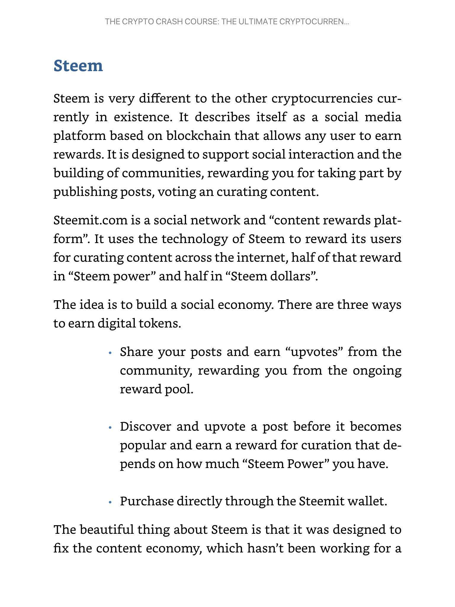

# Crypto Hype Analysis

> Sources: Alan John & Jon Law, 2021
> Raw: [Crypto Technical Analysis](../../raw/crypto/crypto-technical-analysis-your-one-stop-guide-to-investing-trading-and-profiting.md)

## Overview

Hype analysis is the discipline of identifying and trading on real-world social trends and sentiment. Crypto markets are uniquely driven by hype — perhaps more than any other major asset class. Elon Musk tweeting "Doge" sent Dogecoin from $0.036 to $0.082 in five days (a 220% gain). Entire sectors (DeFi, gaming coins, Web3) can blow up simultaneously when social momentum hits a tipping point.

Hype analysis carries the highest risk-reward profile of the three analysis types (TA, FA, hype). It is not a historically proven method in traditional finance but has generated outsized returns in crypto when done with proper risk management.

## Social Media Sentiment

### Twitter, Reddit, Discord, and Telegram

Crypto trends originate and amplify on social platforms. Key channels:

- **Twitter**: Influencer tweets, announcement accounts, and crypto personalities drive immediate price action. Elon Musk's coin mentions are the most extreme example.
- **Reddit**: Subreddits like r/CryptoCurrency and r/WallStreetBets coordinate sentiment and occasionally organize coordinated buying.
- **Discord and Telegram**: Project-specific communities provide real-time pulse on sentiment. Insider information and pump-and-dump coordination often occur in private groups.

Sourcing trends means identifying social momentum early. The safest approach is not to predict trends before they happen, but to recognize them as they build and enter before peak popularity.

### Sentiment Analysis Tools

- **Fear & Greed Index** (alternative.me): Ranges 0 (extreme fear) to 100 (extreme greed). Contrariwise, extreme fear is a buy signal and extreme greed is a sell signal.
- **Bulls & Bears Index** (augmento.ai): Analyzes social media bullish/bearish sentiment about Bitcoin from Twitter, Reddit, and Bitcointalk.
- **Santiment**: Free sentiment analysis tools tracking trending topics and market-wide sentiment shifts.

## News Impact Analysis

News moves crypto markets faster and more dramatically than traditional markets due to lower liquidity and retail-driven sentiment.

### Categories of News Events

- **Regulation**: Government announcements about crypto legality, taxation, or bans. Negative regulation (China bans, SEC actions) causes sharp selloffs; positive regulation (ETF approvals, legal clarity) drives rallies.
- **Adoption**: Partnerships, corporate treasuries adding Bitcoin, merchant adoption. These validate the asset class and drive long-term demand.
- **Hacks and Security Incidents**: Exchange hacks (12 exchanges hacked in 2019, $293M stolen) cause immediate selloffs in the affected asset and sector-wide fear.
- **Technology Milestones**: Mainnet launches, upgrade completions, scaling solutions. These confirm the project is executing on its roadmap.

### Trading News

Crypto markets are not fully efficient — events weeks or months out are often not priced in. Buying based on scheduled events with a weeks-to-months horizon can be profitable. However, if enough traders front-run an event expecting a pump, the price can crash on the day of the event even with good news. This is the "buy the rumor, sell the news" phenomenon amplified in crypto.

## Google Trends and Search Volume

Google Trends data provides a lagging but useful confirmation of trend intensity. Search volume for "Bitcoin," specific coin names, or sector terms (DeFi, NFT) peaks near market tops and bottoms near market bottoms. Extreme search volume suggests retail euphoria and potential tops. Combined with price action, it offers timing context for exits during hype cycles.

## Fear & Greed Index

The Crypto Fear & Greed Index (alternative.me) quantifies market emotion on a 0-100 scale:
- **0-24**: Extreme Fear — potential buying opportunity.
- **25-44**: Fear — cautious accumulation.
- **45-55**: Neutral — balanced sentiment.
- **56-74**: Greed — increasing risk of correction.
- **75-100**: Extreme Greed — market likely overextended, potential sell signal.

The index aggregates volatility, market momentum, social media, surveys, Bitcoin dominance, and Google Trends data.

## Bitcoin Dominance as a Sentiment Indicator

Bitcoin Dominance (BTC market cap / total crypto market cap) acts as a sentiment barometer:

- **Rising dominance**: Capital fleeing altcoins for the relative safety of Bitcoin. Indicates bearish or cautious sentiment toward the broader altcoin market.
- **Falling dominance**: Capital rotating from Bitcoin into altcoins. Signals an "altcoin season" where traders are increasingly willing to take risk.

Bitcoin dominance near extremes often precedes reversals. High dominance suggests altcoins may be oversold; low dominance suggests altcoin euphoria.

## Altcoin Season Index

The Altcoin Season Index measures whether the top 50 coins are outperforming Bitcoin. When 75% or more of the top 50 outperform Bitcoin over a 90-day period, it is declared "altcoin season." This index helps traders decide whether to focus on Bitcoin or rotate into altcoin positions.

## ICO / IDO / IEO Hype Cycles

Initial offerings follow predictable hype cycles:

- **Pre-announcement**: Whispers and insider accumulation.
- **Announcement and hype phase**: Social media amplification, influencer promotions, FOMO builds.
- **Sale/listing**: Initial price surge as public buys in.
- **Post-listing dump**: Early investors and insiders sell, price corrects.

IEOs (Initial Exchange Offerings) have partially replaced ICOs by streamlining the investment process directly through exchange platforms. The hype cycle remains similar but with slightly reduced pump-and-dump amplitude due to exchange oversight.

## Pump and Dump Detection

Pump and dump schemes are systematic: a group buys a low-cap coin, hypes it through social channels, convinces others to buy, then sells at the inflated price. Warning signs include:

- **Volume spikes**: Sudden, massive volume on low-cap coins without corresponding news or fundamentals.
- **Social media coordination**: Simultaneous promotion across Telegram groups, Discord servers, and Twitter.
- **Price patterns**: Sharp vertical candles with long upper wicks as the dump begins.
- **Order book patterns**: Large sell walls appearing after price spikes.

Detecting these requires monitoring volume, social sentiment, and order book depth simultaneously. Legitimate hype-driven moves show sustained volume; pump-and-dumps show a single massive volume spike followed by collapse.

## Combining Hype Analysis with Technical Analysis

The most robust approach combines hype signals with TA confirmation:

1. **Identify trend/sector through hype signals**: Social media momentum, news events, Google Trends.
2. **Confirm with TA chart patterns**: Look for breakouts from consolidation patterns, volume confirmation, and RSI/MACD alignment.
3. **Manage risk**: Hype trades are inherently high-risk. Use strict stop-losses, position size appropriately, and never invest more than you can afford to lose.
4. **Time exits with sentiment extremes**: When Fear & Greed reaches extreme greed, social media is saturated, and Google Trends peaks, it is likely time to take profits.

This layered approach captures the upside of hype-driven moves while using TA discipline to manage the extreme downside risk.

## See Also

- [Crypto Technical Analysis](crypto-technical-analysis.md)
- [Crypto Fundamental Analysis](crypto-fundamental-analysis.md)
- [Blockchain Technology](blockchain-technology.md)
- [Cryptocurrency Fundamentals](crypto-fundamentals.md)
- [Volume Profile](../trading/volume-profile.md)
- [Order Flow and Footprint](../trading/order-flow-footprint.md)
- [Contrarian Sentiment Analysis](../trading/contrarian-sentiment-analysis.md)
## 🔗 Graph Connections

| Concept            | Relation       | Source    |
| ------------------ | -------------- | --------- |
| Technical Analysis | Contrasts With | EXTRACTED |
| Trading Psychology | Influenced By  | EXTRACTED |
