# Crypto Technical Analysis

> Sources: Alan John & Jon Law, 2021
> Raw: [Crypto Technical Analysis](../../raw/crypto-technical-analysis/2026-05-20-crypto-technical-analysis.md)

## Why Technical Analysis Works for Crypto

Technical analysis (TA) is the discipline of discerning future price movements from historical patterns. Its three core premises — history tends to repeat itself, the market discounts everything, and prices move in trends — apply especially well to cryptocurrency markets.

Crypto markets differ from traditional markets in ways that make TA particularly effective:

- **Retail-driven sentiment**: Crypto is heavily influenced by retail traders whose emotional patterns (fear and greed) create recognizable, repeating chart formations.
- **24/7 markets**: Unlike stock markets, crypto trades round the clock. No gaps between sessions means continuous price data and more reliable technical formations.
- **High volatility**: Crypto is the most volatile major asset class. Larger price swings create clearer breakout signals and more pronounced pattern completions.
- **Lower liquidity**: Smaller market caps (relative to equities) mean that technical support and resistance levels tend to hold more dramatically as order flow concentrates at psychologically significant prices.

Crypto is the most volatile major asset class, with price swings that regularly exceed 10% in a single day — far beyond stocks, bonds, or real estate.

## Chart Types

### Line Chart

The simplest chart type, connecting closing prices with a single line. While easy to read, it discards intra-period price action. Beginner-friendly platforms (Coinbase, Robinhood) default to line charts, but serious crypto traders prefer richer formats.

### Candlestick Chart

The standard for crypto TA. Each candle displays open, high, low, and close (OHLC) for a given period. Green candles (close above open) indicate buying pressure; red candles (close below open) indicate selling pressure. Wicks (shadows) show the period's extreme prices.

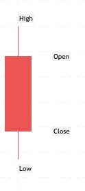
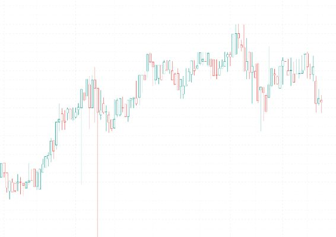

Candlestick patterns form the backbone of crypto TA because the 24/7 market generates clean, uninterrupted candle sequences.

### Renko, Point & Figure, and Heikin-Ashi

Renko charts filter out minor price movements using fixed brick sizes, ignoring time entirely. They smooth trends and make support/resistance levels more apparent.

Point & Figure (P&F) charts use stacked Xs (rising prices) and Os (falling prices), removing time and focusing purely on price movement magnitude.

Heikin-Ashi charts average price data over two periods, producing smoother candles that make trends easier to spot. They sacrifice some detail but reduce false signals in choppy markets.

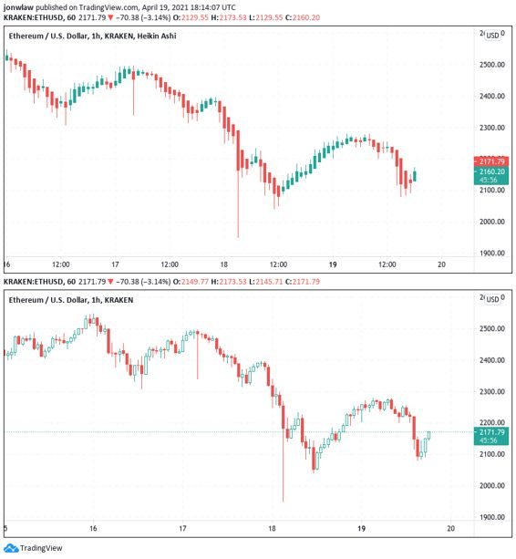

## Chart Patterns

Chart patterns are price formations that predict future movement. Crypto markets produce all standard patterns, with some crypto-specific reliability considerations.

### Triangles

The most common chart formation in crypto. Three types exist:

- **Ascending triangle**: Horizontal resistance, rising support. Bullish breakout likely. Common in crypto uptrends where buying pressure accumulates.
- **Descending triangle**: Horizontal support, falling resistance. Bearish breakout likely.
- **Symmetrical triangle**: Converging trendlines with shrinking range. Breakout direction unpredictable but tends to follow the prior trend.

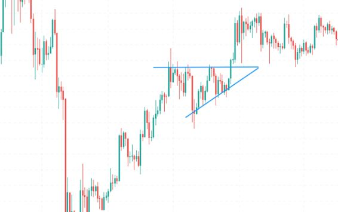
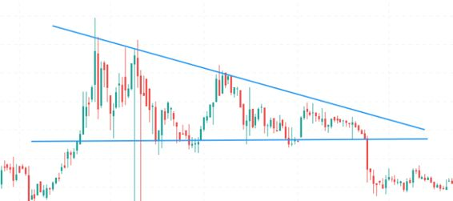

### Head and Shoulders

A reliable bearish reversal pattern (~85% accuracy). Three peaks form — a higher middle peak (head) between two lower peaks (shoulders). The neckline connects the troughs. A close below the neckline confirms the reversal. Inverse head and shoulders signals bullish reversals.

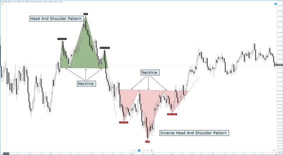

### Double Top / Double Bottom

Double tops (M-shaped) mark bearish reversals; double bottoms (W-shaped) mark bullish reversals. The patterns are the most common reversal formations in crypto. Reliability increases with volume confirmation on the second peak or trough.

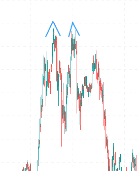

### Flags, Pennants, and Wedges

These continuation patterns form after strong directional moves. Flags are parallel channels, pennants are small symmetrical triangles, and wedges are converging trendlines sloping against the prior trend. In crypto's volatile market, these patterns often produce explosive breakouts.

### Cup and Handle

A bullish continuation pattern resembling a tea cup. Forms over weeks or months. The handle is a shallow pullback before the breakout. As crypto markets mature, cup and handle formations are becoming more common on large-cap coins.

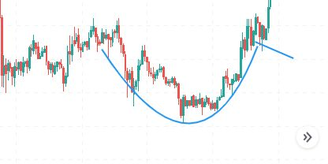

## Candlestick Patterns

Candlestick patterns are short-term formations (1-3 candles) that signal reversals or continuations. In crypto's volatile environment, they produce more false signals than in traditional markets, making confirmation essential.

### Single-Candle Patterns

- **Hammer**: Short body, long lower wick at the bottom of a downtrend. Bullish reversal signal.
- **Shooting Star**: Small lower body, long upper wick at the top of an uptrend. Bearish reversal. The upper wick must be at least 2x the body length.
- **Doji**: Open and close nearly equal, forming a cross. Signals indecision and potential reversal. Five types: standard, long-legged, dragonfly, gravestone, and four-price doji.
- **Marubozu**: Long candle with little to no wick. Indicates strong momentum in the direction of the candle.
- **Spinning Top**: Small body centered between long upper and lower wicks. Neutral, indicates indecision.

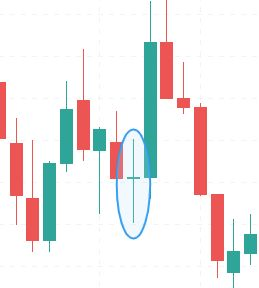

### Multi-Candle Patterns

- **Bullish Engulfing**: Red candle followed by a larger green candle that completely engulfs the first body. Common bullish reversal in crypto.
- **Bearish Engulfing**: Green candle engulfed by a larger red candle. Bearish reversal.
- **Morning Star**: Three-candle pattern at the bottom of a downtrend — long red, short-bodied, long green. Bullish reversal.
- **Evening Star**: Three-candle pattern at the top of an uptrend — long green, short-bodied, long red. Bearish reversal.
- **Three White Soldiers**: Three consecutive long green candles with small wicks. Strong bullish reversal.
- **Three Black Crows**: Three consecutive long red candles with small wicks. Strong bearish reversal.
- **Piercing Line**: Downtrend pattern: red candle followed by green candle closing above the red's midpoint. Bullish.
- **Dark Cloud Cover**: Uptrend pattern: green candle followed by red candle closing below the green's midpoint. Bearish.
- **Harami**: Two-candle reversal pattern where a small candle is contained within the previous large candle's body.
- **Abandoned Baby**: Rare three-candle pattern with a doji gapping between two opposing candles. Reliable reversal signal.

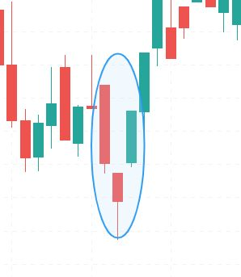
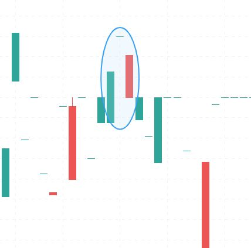

### Reliability in Crypto

Candlestick patterns in crypto require volume confirmation. Crypto's high volatility produces more false patterns (called "head fakes") than equities. Patterns are most reliable on higher timeframes (4h, daily, weekly) and on large-cap coins with deeper liquidity.

## Indicators

### Moving Averages (SMA and EMA)

Moving averages smooth price data into trend-identifying lines. The Simple Moving Average (SMA) gives equal weight to all periods; the Exponential Moving Average (EMA) weights recent price more heavily, making it more responsive.

Common periods: 5, 10, 20, 50, 100, 200. Crossovers generate signals — a shorter MA crossing above a longer MA is bullish (golden cross); crossing below is bearish (death cross).

In crypto, the 50-day and 200-day MAs are the most watched. They frequently serve as dynamic support and resistance. EMA crossovers produce more signals but also more false signals in choppy crypto markets.

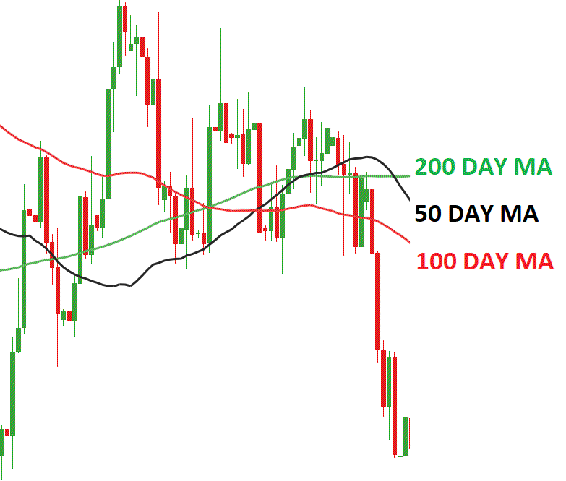

### Bollinger Bands

A price envelope consisting of a middle band (SMA) and upper/lower bands set at standard deviations from the middle. Approximately 90% of price action occurs between the bands. When price hugs the upper band, the asset is overbought; hugging the lower band signals oversold conditions. Band squeezes (narrowing) often precede violent breakouts — a common occurrence in crypto.

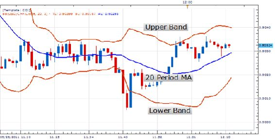

### Ichimoku Cloud

A comprehensive indicator combining momentum, trend, support, and resistance. Five lines form the cloud:

- **Tenkan-Sen** (baseline): Short-term moving average, indicates trend direction.
- **Kijun-Sen** (conversion line): Longer-term moving average, acts as support/resistance.
- **Senkou Span A** (leading span A): Average of Tenkan and Kijun, shifted forward.
- **Senkou Span B** (leading span B): Wider average, shifted forward. The space between A and B forms the cloud.
- **Chikou Span** (lagging span): Current price shifted 26 periods back.

When Tenkan and Kijun are above the cloud, the trend is bullish. Crossovers within the cloud reinforce signals. The Ichimoku Cloud is particularly useful for crypto's trending markets.

### Parabolic SAR

A series of dots below (bullish) or above (bearish) price. Dots crossing price signal a trend reversal. Works best in strongly trending crypto markets, poorly in sideways/choppy conditions.

### Fibonacci Retracement

Horizontal lines at key Fibonacci levels (23.6%, 38.2%, 50%, 61.8%, 100%) drawn between a high and low. These levels identify potential support and resistance. Crypto markets frequently respect these levels, especially the 38.2% and 61.8% retracements.

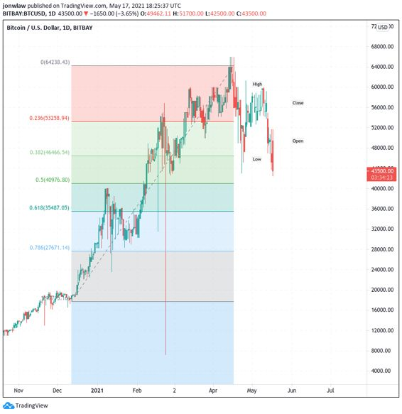

## Oscillators

Oscillators fluctuate within fixed bounds (typically 0-100) and identify overbought and oversold conditions.

### Relative Strength Index (RSI)

Measures the speed and magnitude of price changes. Range: 0-100. Above 70 = overbought (sell signal). Below 30 = oversold (buy signal). In strong crypto trends, RSI can stay in overbought/oversold territory for extended periods, reducing reliability. Divergence between RSI and price is a powerful signal — bullish divergence when price makes lower lows but RSI makes higher lows.

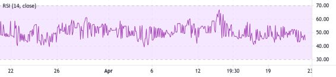

### MACD (Moving Average Convergence Divergence)

Subtracts the 26-day EMA from the 12-day EMA. The MACD line, signal line (9-day EMA of MACD), and histogram show momentum shifts. MACD crossing above the signal line is bullish; crossing below is bearish. Histogram height indicates trend strength. MACD is most reliable on daily and weekly timeframes in crypto.

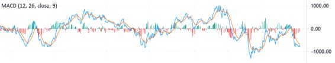

### Stochastic Oscillator

Compares closing price to the price range over a period. Range: 0-100. Above 80 = overbought; below 20 = oversold. As a leading indicator, it predicts reversals before they occur. The slow stochastic (SMA-smoothed) produces fewer false signals in crypto than the fast version.

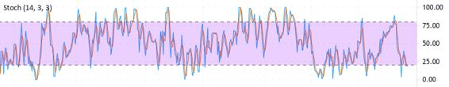

### Money Flow Index (MFI)

A volume-weighted RSI. Above 80 = overbought; below 20 = oversold. Incorporates volume makes it more reliable than RSI alone for confirming breakouts. Divergence between MFI and price is a strong signal.

### Other Oscillators

The True Strength Index (TSI), Commodity Channel Index (CCI), Klinger Oscillator, Percentage Price Oscillator (PPO), Percentage Volume Oscillator (PVO), Chaikin Oscillator, Chande Momentum Oscillator (CMO), Ultimate Oscillator (UO), and Awesome Oscillator (AO) all offer specialized views of momentum and volume. In practice, RSI, MACD, and Stochastic are the three essential oscillators for crypto TA.

## Key Differences: TA in Crypto vs Traditional Markets

**24/7 Market**: No opening/closing gaps. Continuous price data means patterns form without the distortions of session breaks. However, weekends can see lower liquidity and more erratic moves.

**Higher False Signal Rate**: Crypto's volatility generates more false breakouts and pattern failures. Confirmation — through volume, multiple timeframe analysis, or secondary indicators — is essential.

**Volume Confirmation**: Volume is the most critical confirming indicator in crypto. A breakout on low volume is likely a head fake. Genuine moves show volume spikes coinciding with price breakthroughs.

**Psychological Levels**: Round numbers ($10,000, $50,000 for Bitcoin) act as powerful magnets and support/resistance levels. Crypto traders are highly sensitive to these psychologically significant prices.

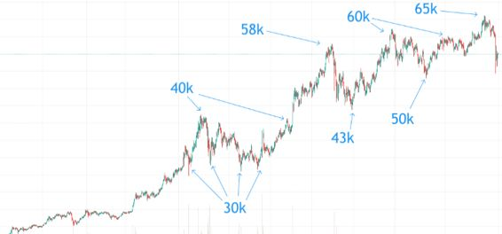

## See Also

- [Crypto Fundamental Analysis](crypto-fundamental-analysis.md)
- [Crypto Hype Analysis](crypto-hype-analysis.md)
- [Blockchain Technology](blockchain-technology.md)
- [Cryptocurrency Fundamentals](crypto-fundamentals.md)
- [Volume Profile](../trading/volume-profile.md)
- [Order Flow and Footprint](../trading/order-flow-footprint.md)
- [Contrarian Sentiment Analysis](../trading/contrarian-sentiment-analysis.md)
