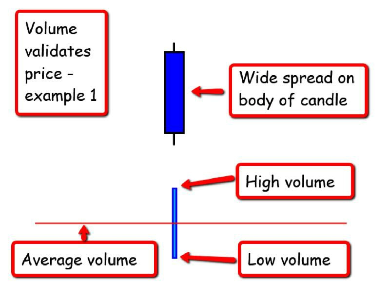
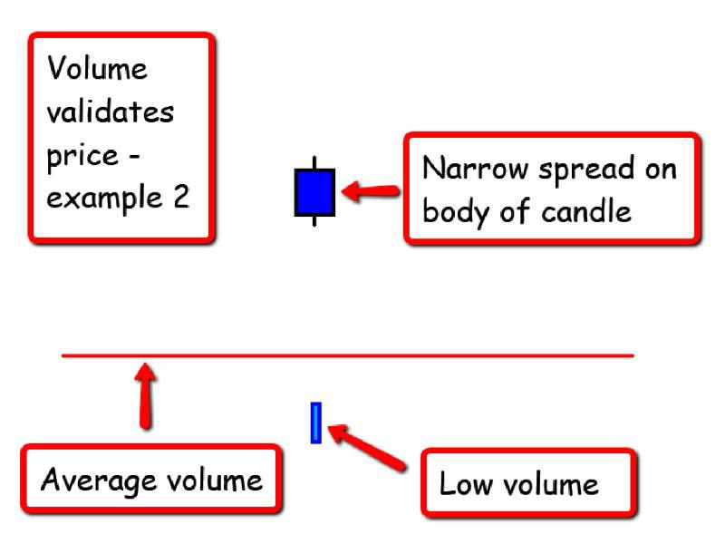
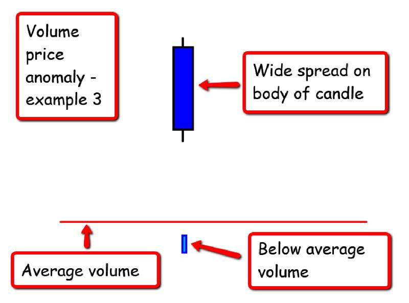
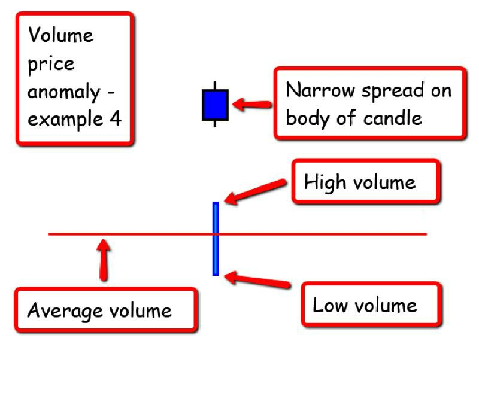
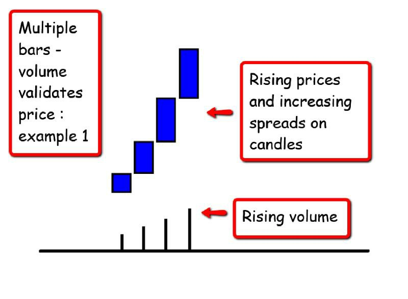
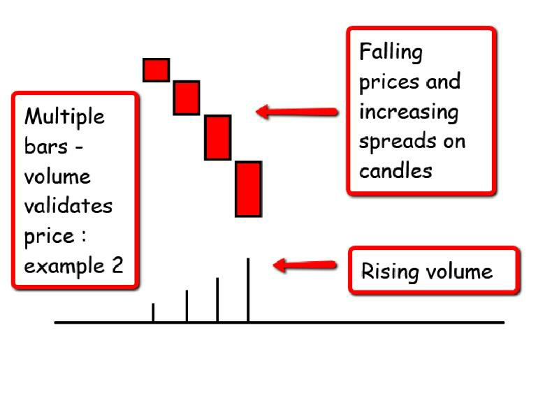
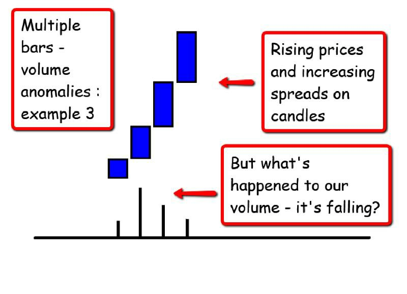
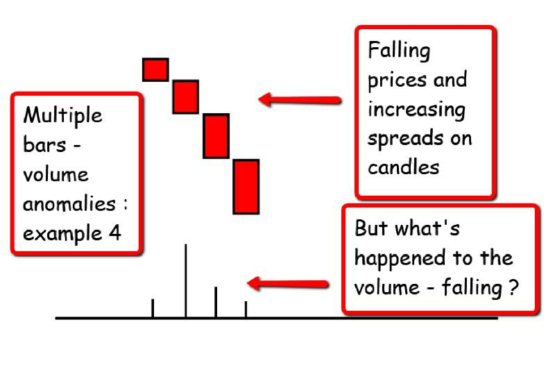

# Bar Chart Reading — Price, Range, Close, and Volume

> Sources: David Weis, 2013; Rubén Villahermosa Chaves, 2021; Anna Coulling, 2013
> Raw: [Trades About to Happen](../../raw/trading/trades-about-to-happen-2013.md); [Wyckoff 2.0 Structures](../../raw/trading/wyckoff-2-0-structures-volume-profile-and-order-flow-combining-the-logic-of-the-.md); [A Complete Guide To Volume Price Analysis](../../raw/trading/a-complete-guide-to-volume-price-analysis-read-the-book-then-read-the-market-ann.md)

## Overview

The logic of reading bar charts forms the foundation of the Wyckoff approach. Each price bar carries three pieces of information: the price range (high to low), the position of the close within that range, and the volume. The interplay of these three elements reveals the balance of power between buyers and sellers.

## The Three Components

### 1. Price Range (High to Low)
- **Wide range bars** with a close near the high = strong buying, ease of upward movement
- **Wide range bars** with a close near the low = strong selling, ease of downward movement
- **Narrow range bars** indicate indecision, balance, or a pause before the next move
- **Shortening of thrust** — when bars in the trend direction become progressively narrower, momentum is fading

### 2. Position of the Close
- Close in the upper half = buyers in control during that period
- Close in the lower half = sellers in control
- Close in the exact middle = balance, uncertainty
- The close is the most important single data point; it reflects the outcome of the period's struggle

### 3. Volume
- Confirms price action when volume expands in the direction of the trend
- Contradicts price action when volume is heavy but price makes little progress (effort vs. reward divergence)
- Volume tells the logical story of supply and demand; price merely denotes value
- High-volume areas often act as future support or resistance (tests of these areas are significant)

## Effort vs. Reward

The most important concept: compare the volume (effort) with the price movement (reward).

- **Large effort, small reward** = a potential turning point. The side putting in effort is being absorbed.
- **Small effort, large reward** = ease of movement. The trend is likely to continue.
- **Large effort in one direction with follow-through** = trend strength.

## Reading Bar Charts in Practice

Weis teaches a "right-to-left" reading approach: stand at the rightmost bar and look backward, asking what the sequence of bars reveals about the struggle. Each new bar either confirms or challenges the story told by the previous bars.

## Advanced Chart Types (Villahermosa)

Beyond standard time-based bar charts, modern analysis uses chart types that filter time to focus on other variables:

### Tick Charts
Each bar represents a fixed number of transactions (e.g., 1000 ticks). Useful for:
- Seeing market activity during slow vs. active periods
- Normalizing bar count across sessions
- Identifying true support/resistance based on transaction count

### Volume Charts
Each bar represents a fixed amount of volume (e.g., 1000 contracts). Useful for:
- Ensuring each bar has meaningful participation
- Highlighting periods of high vs. low activity
- Better context for Wyckoff volume analysis

### Range Charts
Each bar represents a fixed price movement (e.g., 10 points). Useful for:
- Filtering noise in ranging markets
- Identifying clear trend structures
- Removing time-based distortions

## Candle Reading Principles (Coulling)

Coulling applies VPA specifically to candlesticks rather than bars. Her candle reading complements the bar-based approach above:

### Key Principles for Candles

1. **The wick is always the first point of focus** — the length of any wick instantly reveals impending strength, weakness, or indecision, and the extent of associated market sentiment
2. **No wick** — signals strong market sentiment in the direction of the closing price
3. **Narrow body** — weak market sentiment; **wide body** — strong market sentiment
4. **Context determines meaning** — a candle of the same type means something different at a trend high vs. within a range
5. **Volume validates price** — start with the candle, then look for volume confirmation or anomaly

### Premier VPA Candles

Coulling identifies three premier candles:

- **Shooting star** — long upper wick, small body near the low. Signals weakness. Significance depends on volume.
- **Hammer** — long lower wick, small body near the high. Signals strength. Requires follow-through.
- **Doji** — open and close nearly equal. Indecision. Meaningful only with high volume at a trend extreme.

These candles provide the entry signals in Coulling's VPA system, similar to how Weis uses springs/upthrusts but based on single-candle morphology rather than support line penetrations.

## Figures from A Complete Guide To Volume Price Analysis — Ch.3-4

## Figures from Trades About to Happen — Ch.3-4

## Figures from Wyckoff 2.0 — Part 1

## See Also

- [Wyckoff Method Overview](wyckoff-method-overview.md)
- [Volume Profile](volume-profile.md)
- [Springs](springs.md)
- [Upthrusts](upthrusts.md)
- [Absorption](absorption.md)
- [Point-and-Figure and Renko](point-figure-renko.md)
- [Volume Price Analysis (VPA)](volume-price-analysis-vpa.md)
- [Volume at Price (VAP)](volume-at-price-vap.md)
## 🔗 Graph Connections

| Concept | Relation | Source |
|---|---|---|
| Bullish Engulfing | Part Of | EXTRACTED |
| Candlestick Chart | Formed On | EXTRACTED |
| Candlestick Patterns (50) | Formed On | EXTRACTED |
| Doji / Doji Stars | Part Of | EXTRACTED |
| Hammer | Part Of | EXTRACTED |
| Heikin-Ashi Chart | Derived From | EXTRACTED |
| Renko Chart | Alternative To | EXTRACTED |
| Technical Analysis | Uses | EXTRACTED |
| Volume Price Analysis (VPA) | Teaches | EXTRACTED |

### Related Images

