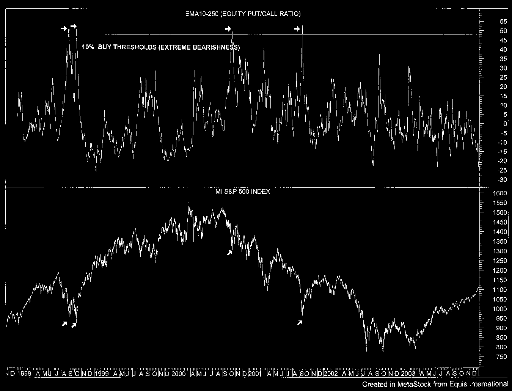
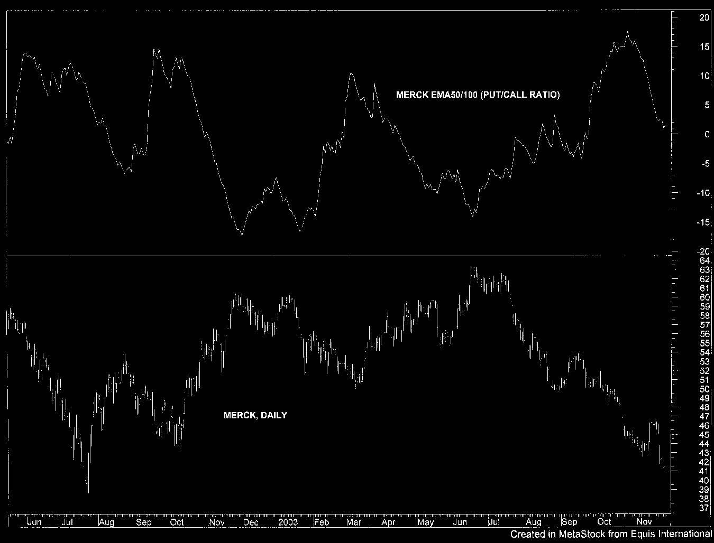

# Contrarian Sentiment Analysis

> Sources: John F. Summa, Unknown
> Raw: [Trading Against the Crowd](../../raw/trading/trading-against-the-crowd-profiting-from-fear-and-greed-in-stock-futures-and-opt.md)

## Overview

Contrarian sentiment analysis is based on a simple observation: when the majority of traders agree on the direction of the market, that direction is likely to reverse. By measuring the sentiment of the "crowd" through options volume, implied volatility, short selling, and advisory opinions, a contrarian identifies extremes that mark turning points.

## Core Principle

Markets are driven by fear and greed. At major tops, greed is at its peak — the crowd is most bullish. At major bottoms, fear is at its peak — the crowd is most bearish. Sentiment indicators measure these emotional extremes and signal when the crowd is likely wrong.

## Put/Call Ratio

The put/call ratio is the most widely used sentiment indicator. It compares the volume of put options traded (bearish bets) to call options traded (bullish bets).

### Interpretation

- **High put/call ratio** — excessive bearishness (puts > calls). Contrarian buy signal: the crowd is too bearish.
- **Low put/call ratio** — excessive bullishness (calls > puts). Contrarian sell signal: the crowd is too bullish.

### Ratio Types

| Ratio | What It Measures | Best Use |
|-------|-----------------|----------|
| **Equity-only put/call** | Non-index options (retail traders) | Best contrarian indicator — "Joe Options Trader" sentiment |
| **CBOE total put/call** | All exchange-traded options | Broader market sentiment, less contrarian power |
| **OEX put/call** | S&P 100 (OEX) index options | "Smart money" — index traders tend to be right |

The **equity-only put/call ratio** is the most reliable contrarian signal because non-professional traders (the crowd) consistently get market direction wrong at extremes. The **OEX put/call ratio**, by contrast, tends to be a smart money indicator — OEX traders are often right about direction.

### Using Put/Call Ratios

1. Calculate an EMA crossover (e.g., 5-period EMA and 21-period EMA of the ratio)
2. When the fast EMA crosses above the slow EMA (ratio rising = bearish sentiment building), it signals a potential buying opportunity
3. When the fast EMA crosses below the slow EMA (ratio falling = bullish sentiment building), it signals a potential selling opportunity
4. The best signals occur when the ratio reaches extreme levels relative to its historical range

## Squeeze Play I: Price Trigger System

A trading system that combines put/call ratio extremes with price action:

1. **Sentiment condition**: the equity-only put/call ratio oscillator (EMA5-21) reaches an extreme
2. **Price trigger**: price must confirm with a move in the intended direction
3. **Entry**: long when sentiment is bearish extreme + price breaks above a short-term moving average; short when sentiment is bullish extreme + price breaks below

The price trigger prevents entering early. The sentiment condition identifies potential reversals; the price trigger confirms the reversal is underway.

### System Rules

- Use daily data for medium-term signals (holding period 10-30 days)
- Use a 21-period EMA of price as the trend filter
- Enter only when sentiment is in the extreme quartile of its historical range
- Use ATR-based stops

## Squeeze Play II: Pure Sentiment System

A variation that trades on sentiment extremes alone without a price trigger. More trades but lower reliability. Suitable for traders who want earlier entry at the cost of more false signals. Best applied to index markets for longer holding periods.

## Tsunami Sentiment Wave

A multi-indicator contrarian system that combines:

1. **Put/call ratio** — equity-only at extreme levels
2. **Implied volatility** — VIX or equity IV at extreme levels (see below)
3. **Short selling ratio** — public short sales at extreme levels (see below)
4. **Advisory sentiment** — bull/bear ratio among newsletter writers (see below)

When three or more indicators simultaneously reach contrarian extremes, the "tsunami wave" is forming. The trade is entered in the opposite direction of the sentiment consensus.

## Option Implied Volatility as Sentiment

Implied volatility (IV) reflects the market's expectation of future volatility. High IV indicates fear; low IV indicates complacency.

### Equity Indices

- **High IV** (VIX > 30) — extreme fear, bearish sentiment at its peak. Contrarian buy signal.
- **Low IV** (VIX < 15) — extreme complacency, bullish sentiment at its peak. Contrarian sell signal.

### Individual Stocks

Option IV extremes on individual stocks provide more targeted contrarian signals. A stock with elevated put IV (fear) relative to its historical range is a potential buying opportunity. The key is comparing current IV to a relevant historical lookback period (e.g., 3-6 months).

### Sentiment Long Waves

Stock options volatility tends to move in long waves (months to years). These waves create extended periods of high or low sentiment. The contrarian approach is to fade extreme IV levels: buy when IV spikes (market panic) and sell or buy puts when IV collapses (excessive complacency).

## Short Selling Ratios

Short selling data measures how many market participants are betting on a decline.

### Public Short Sales (Odd-Lot Shorts)

Small traders (odd-lot short sellers) are historically poor at timing short positions. When public short selling reaches extreme levels, it is a contrarian buy signal — the crowd is overly bearish.

### NYSE Short Interest Ratio

Total short interest divided by average daily volume. A high value (heavy shorting) is potentially bullish (contrarian); a low value (light shorting) is potentially bearish.

### Specialist Short Sales (Historical)

Before regulatory changes, specialist short selling data was a smart money indicator. Specialists (market makers) tended to short at tops and cover at bottoms. This data is less reliable in modern markets but the principle applies to any market-maker or institutional short activity that can be tracked.

## Advisory Sentiment (Bull/Bear Ratio)

Measures the percentage of newsletter writers and market advisors who are bullish vs. bearish. The **Investors Intelligence** survey is the most widely followed:

- **Extreme bullishness** (>55% bulls) — advisors are too optimistic. Contrarian sell.
- **Extreme bearishness** (<25% bulls) — advisors are too pessimistic. Contrarian buy.

The measure works best when coupled with price confirmation.

## Media Sentiment (The Fourth Estate)

Financial media amplifies sentiment extremes. Academic research shows that extreme media coverage correlates with market turning points:

- **Prolonged bearish coverage** (recession fears, crash predictions) — potential bottom
- **Euphoric bullish coverage** (parabolic predictions, "new era" narratives) — potential top

Combined with quantitative sentiment indicators, media sentiment provides a qualitative check on whether the market is at an emotional extreme.

## Figures from Trading Against the Crowd

## See Also

- [Market Ecosystem and Participants](market-ecosystem-participants.md)
- [Auction Market Theory](auction-market-theory.md)
- [Volume Profile](volume-profile.md)
- [Order Flow and Footprint](order-flow-footprint.md)
- [Absorption](absorption.md)
- [Crypto Hype Analysis](../crypto_trading/crypto-hype-analysis.md) — hype/sentiment analysis for cryptocurrency markets
- [Options Volatility](../trading_options/options-volatility.md) — implied volatility, VIX, volatility skew for options
## 🔗 Graph Connections

| Concept | Relation | Source |
|---|---|---|
| Humphrey B. Neill | Pioneered By | EXTRACTED |
| John Summa | Used By | EXTRACTED |
| Put/Call Ratio | Instrument Of | EXTRACTED |
| Tape Reading | Related To | EXTRACTED |
| Trading Psychology | Related To | EXTRACTED |
