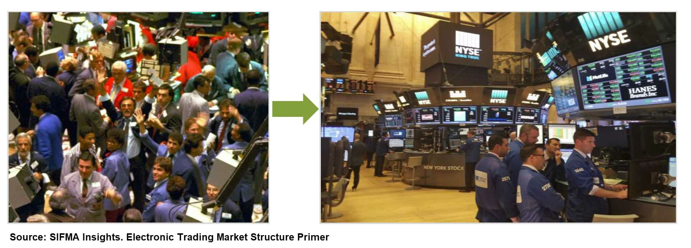
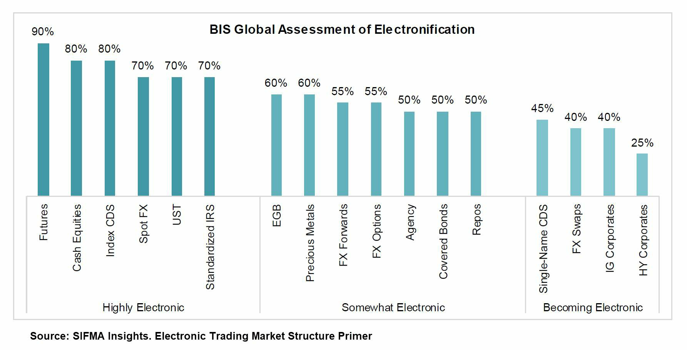
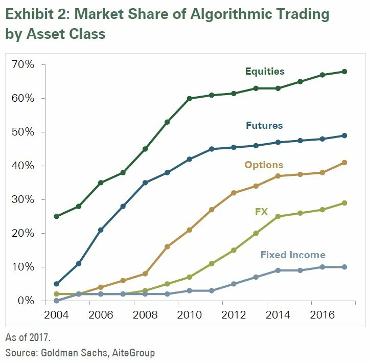
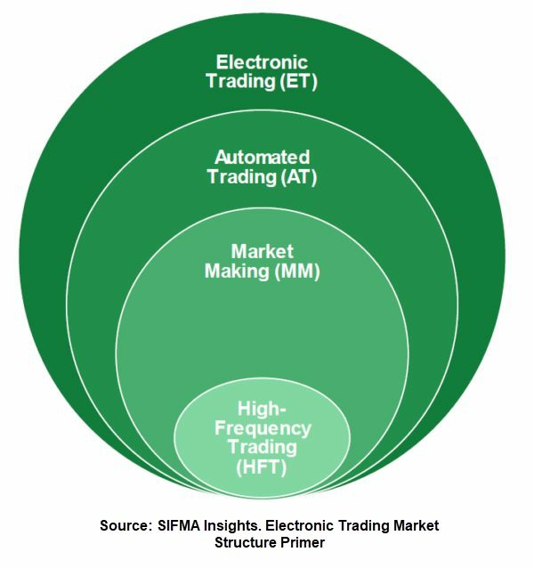
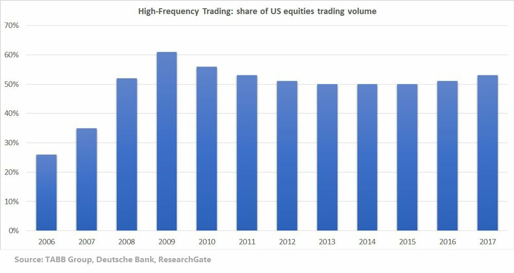
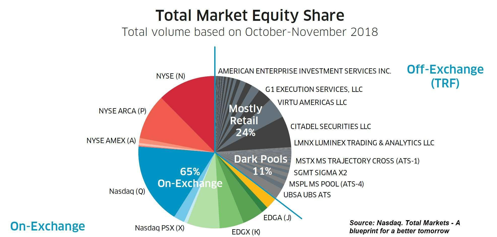
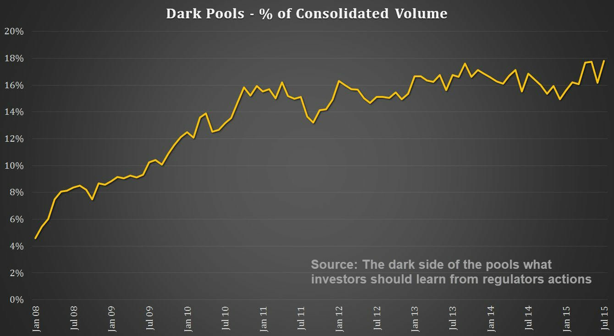
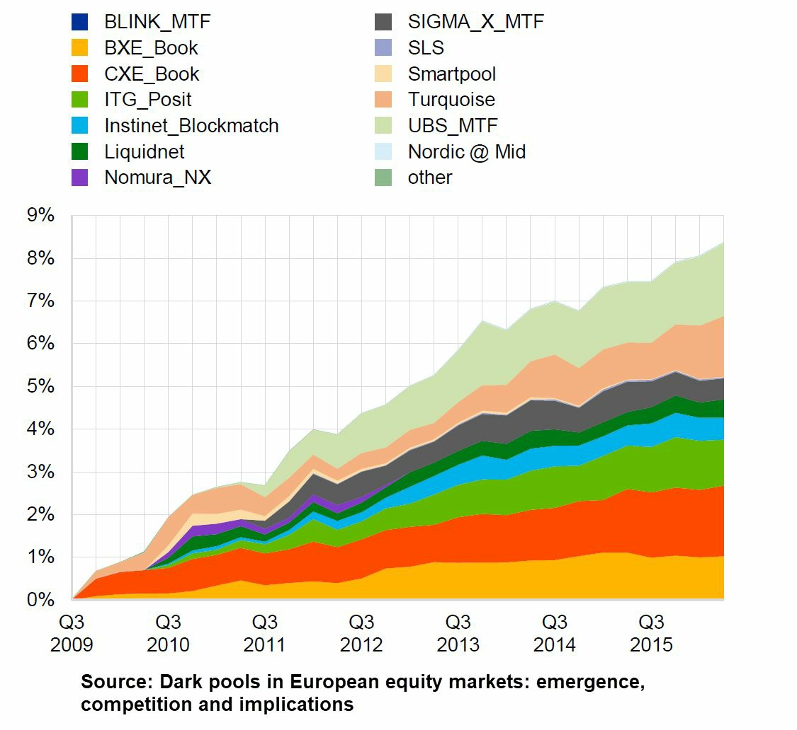

# Market Ecosystem and Participants

> Sources: Rubén Villahermosa Chaves, 2021
> Raw: [Wyckoff 2.0 Structures](../../raw/trading/wyckoff-2-0-structures-volume-profile-and-order-flow-combining-the-logic-of-the-.md)

## Overview

Modern financial markets are composed of a diverse ecosystem of participants, each with different objectives, time horizons, and execution methods. Understanding this ecosystem is essential for interpreting price/volume behavior correctly.

## Types of Market Participants

- **Retail Traders** — individual traders with limited capital, typically shorter time horizons
- **Institutional Investors** — pension funds, mutual funds, insurance companies (large capital, long-term)
- **Hedge Funds** — actively managed funds using various strategies
- **Market Makers** — provide liquidity by continuously quoting BID and ASK
- **Algorithmic Traders** — computer programs executing trades based on programmed logic
- **High Frequency Traders (HFT)** — ultra-fast algorithmic traders profiting from small price discrepancies

## Electronic Markets

### Algorithmic Trading
Algorithms execute trades based on predefined rules. They account for a significant portion of modern market volume. Algorithms can:
- Execute large orders incrementally to minimize market impact
- Arbitrage price differences across venues
- Implement systematic strategies

### High Frequency Trading (HFT)
A subset of algorithmic trading characterized by:
- Ultra-low latency execution (microseconds)
- High turnover rates
- Small profit per trade, large volume
- Strategies include: market making, arbitrage, momentum ignition

## OTC Markets

Over-the-counter markets trade directly between parties without a centralized exchange. Common in:
- Foreign exchange (forex)
- Fixed income
- Derivatives

## Dark Pools

Private exchanges where large orders can be executed without public visibility. Used by institutions to:
- Avoid market impact on large orders
- Hide trading intentions from other participants
- Execute block trades anonymously

## Are Markets Random or Deterministic?

### The Adaptive Markets Hypothesis
A middle ground between the Efficient Market Hypothesis and behavioral finance. Markets are not perfectly efficient nor completely random. Efficiency varies with market conditions, participant composition, and regulatory environment.

### Where Wyckoff Fits
The Wyckoff methodology operates on the premise that markets are **deterministic in structure** — the same patterns of supply and demand repeat across time and markets because they reflect consistent human behavior. The rise of algorithms and HFT has not eliminated these patterns; it has changed their expression but not their underlying logic.

## Figures from Wyckoff 2.0 — Part 3

## See Also

- [Wyckoff Method Overview](wyckoff-method-overview.md)
- [Auction Market Theory](auction-market-theory.md)
- [Wyckoff 2.0 Framework](wyckoff-2-framework.md)
- [Contrarian Sentiment Analysis](contrarian-sentiment-analysis.md) — measuring crowd sentiment in modern markets
- [Cryptocurrency Fundamentals](../crypto_trading/crypto-fundamentals.md) — crypto market structure and participants
- [Options Fundamentals](../trading_options/options-fundamentals.md) — options contract specifications and market mechanics
## 🔗 Graph Connections

| Concept | Relation | Source |
|---|---|---|
| Equity-Only Put/Call Ratio | Contrasts With | EXTRACTED |
| John Summa | Identified By | EXTRACTED |
| Market Makers / Specialists | Conceptually Related To | EXTRACTED |
| OEX Put/Call Ratio | Identifies | EXTRACTED |
| Order Flow | Conceptually Related To | EXTRACTED |
| Richard Ney | Defines | EXTRACTED |
| Smart Money / Insiders | Conceptually Related To | EXTRACTED |
| Volume Price Analysis (VPA) | Teaches | EXTRACTED |

### Related Images

