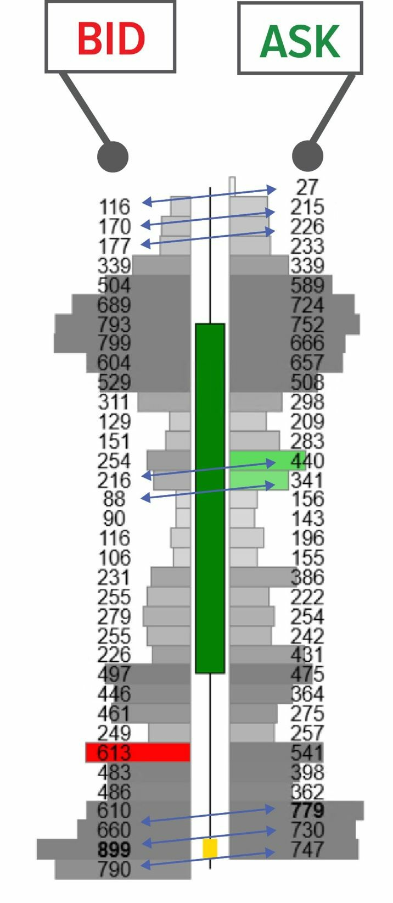
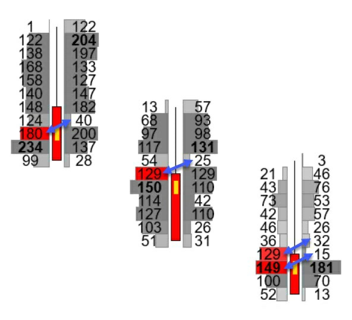
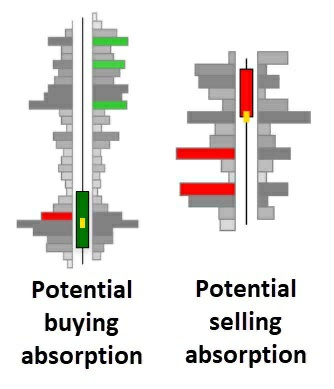
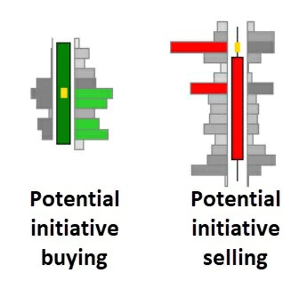
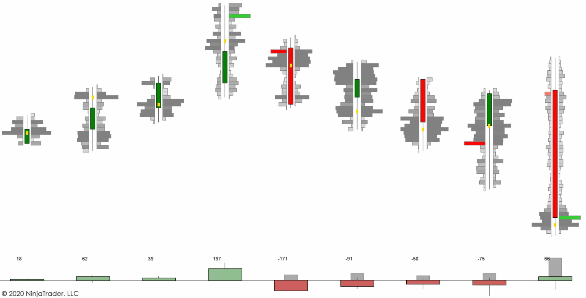
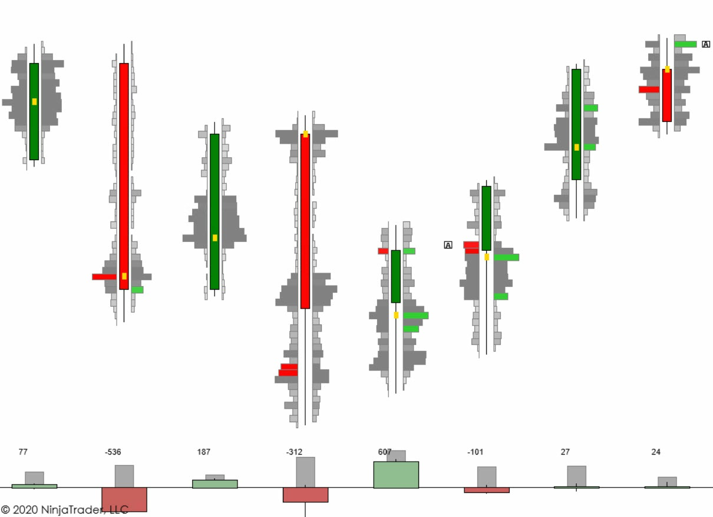
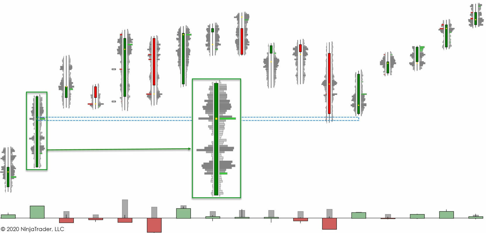
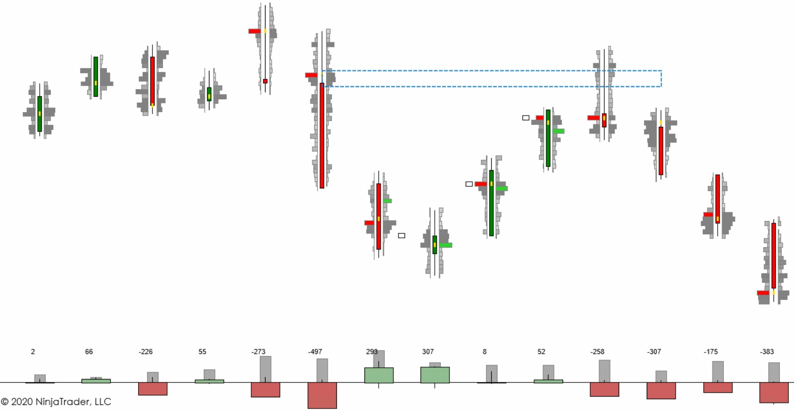
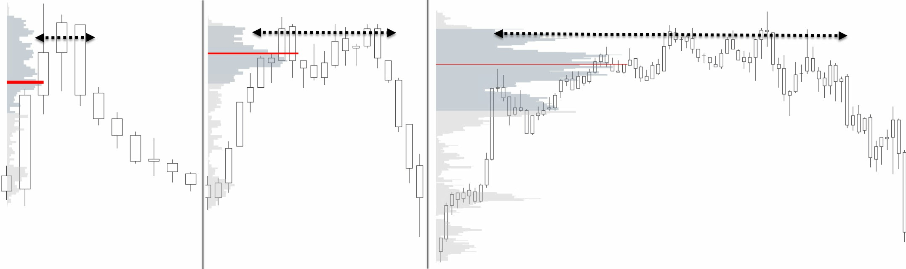
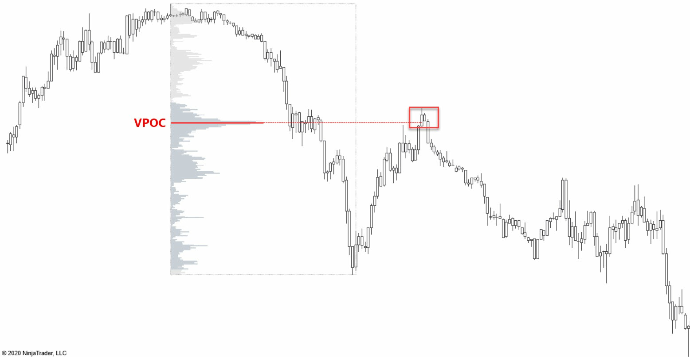

# Order Flow and Footprint Analysis

> Sources: Rubén Villahermosa Chaves, 2021
> Raw: [Wyckoff 2.0 Structures](../../raw/trading/2026-05-20-wyckoff-2-structures.md)

## Overview

Order Flow analysis involves looking inside individual candlesticks to observe the matching of BID and ASK orders. The primary tool is the **Footprint Chart** — a representation showing the volume traded at each price level within a single time period. This is most useful when price reaches key trading zones where institutional imbalances are expected.

## Footprint Reading

### Diagonal Reading

Unlike standard charts which are read horizontally, the footprint is read **diagonally**. This is because participants can trade in different ways:
- Buyers can enter **passively** (BID) or **actively** (ATTACK ASK)
- Sellers can enter **passively** (ASK) or **actively** (ATTACK BID)

To assess strength or weakness at a given price level, compare orders executed diagonally upward: one level of the BID with respect to a higher level in the ASK column.

### Volume Ladder

A configuration where the footprint shows the number of contracts in BID vs. ASK columns plus a volume histogram within each price level of the candlestick. This provides the most visual representation of order flow.

## Imbalances

A large part of key order flow actions relate to **imbalances** — disproportionate volume in one column vs. the opposite column (diagonally). An imbalance should meet minimum parameters:
- A simple difference is not enough
- A 200%, 300%, or 400% disparity is typically required
- The platform can be configured to highlight these automatically

## Turning Patterns

### Bearish Turn (at resistance)
1. **Buying Absorption** — large volume appears on the BID (passive buying) as price reaches resistance
2. **Initiative Selling** — the seller actively attacks the BID, overwhelming the buyers
3. **Result** — downward reversal

### Bullish Turn (at support)
1. **Selling Absorption** — large volume appears on the ASK (passive selling) as price reaches support
2. **Initiative Buying** — the buyer actively attacks the ASK, overwhelming the sellers
3. **Result** — upward reversal

## Continuation Patterns

After the initial turn, a **control** + **test** pattern often develops:
- The turning candle creates a high-volume zone (control)
- Price retraces to test that zone
- If the zone holds, the trend continues in the turning direction

## Delta

Delta is the difference between buying volume and selling volume (BID - ASK). Positive delta means more aggressive buying; negative delta means more aggressive selling. Delta divergence occurs when price makes a new high/low but delta fails to confirm — a warning sign.

## Order Flow Problems

1. **Price Divergence** — price moves in one direction but the footprint shows the opposite story
2. **Delta Divergence** — price makes a new high but delta is lower than on the previous high

## Fractality

Order flow patterns appear across all timeframes. A turning pattern on a 1-minute chart has the same structure as one on a daily chart — only the scale differs.

## Figures from Wyckoff 2.0 — Part 6

## See Also

- [Volume Profile](volume-profile.md)
- [Auction Market Theory](auction-market-theory.md)
- [Wyckoff 2.0 Framework](wyckoff-2-framework.md)
- [Tape Reading and Weis Wave](tape-reading-wis-wave.md)
- [Absorption](absorption.md)
- [Market Ecosystem and Participants](market-ecosystem-participants.md)
- [Volman Pattern Break Setups](../scalping_trading/volman-pattern-break-setups.md) — breakout timing with buildup and signal bars
- [Crypto Technical Analysis](../crypto_trading/crypto-technical-analysis.md) — TA in 24/7 crypto markets
