> Sources: David Weis, 2013
> Raw: [Trades About to Happen](../../raw/trading/trades-about-to-happen-2013.md)

## Overview

Weis applies Wyckoff concepts to point-and-figure (P&F) and Renko charts. These chart types filter time and focus on price movement alone, making them useful for identifying support/resistance levels, trend lines, and price projections.

## Point-and-Figure Charts

P&F charts plot price movements using X's (rising prices) and O's (falling prices) in columns, with no time axis. Key features:

- **Box size** — the minimum price increment plotted
- **Reversal amount** — the number of boxes required to reverse direction (e.g., 1×3 means a 3-box reversal to start a new column)
- P&F charts naturally identify congestion areas which represent "preparation" for future moves

## Price Projections from Congestion

The length of a congestion area on a P&F chart can be used for price projections:
- Count the number of boxes (or trades) along the congestion line
- Multiply by the reversal unit
- Add to (for upside) or subtract from (for downside) the breakout point

Weis cautions: P&F counts are purely mechanical and have no magical powers. They represent potential, not guarantees.

## Renko Charts

Renko charts use bricks of a fixed size, plotted at 45-degree angles. They filter out minor price movements and highlight the underlying trend structure. The same Wyckoff principles (support/resistance, springs, upthrusts, absorption) can be applied.

## Application with the Weis Wave

P&F projections complement the Weis Wave analysis. The "preparation" visible on P&F charts helps determine the magnitude of moves that springs and upthrusts may generate.

## Figures from Trades About to Happen — Ch.11

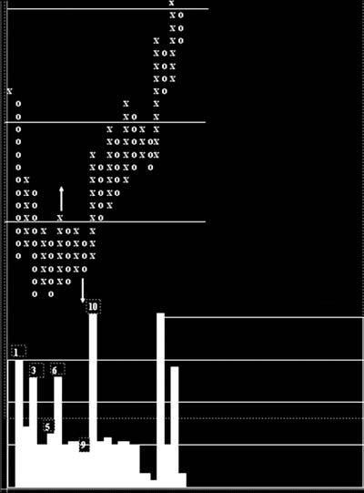

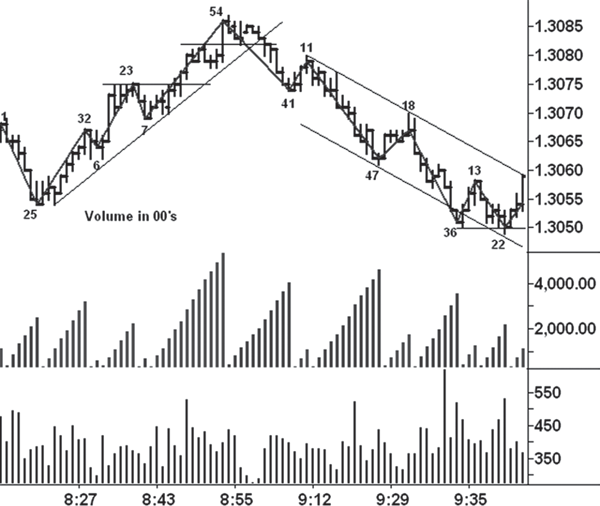

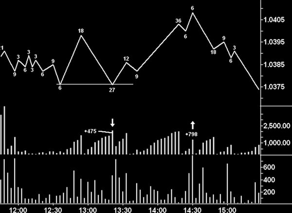

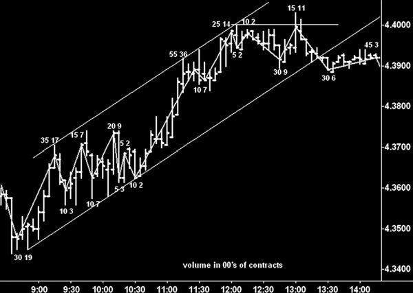

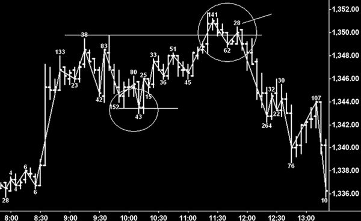

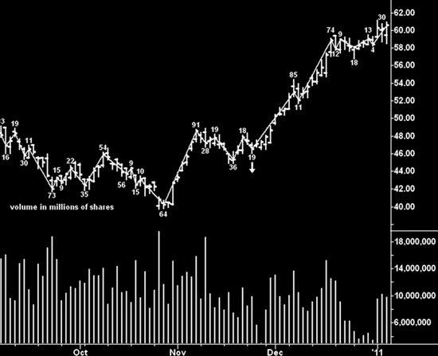

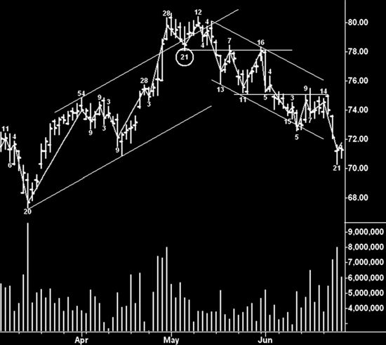

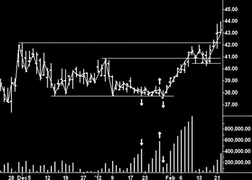

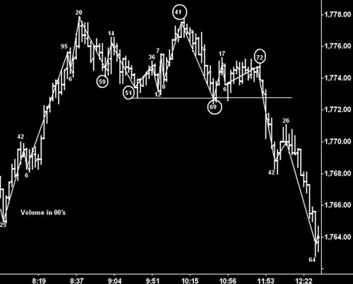

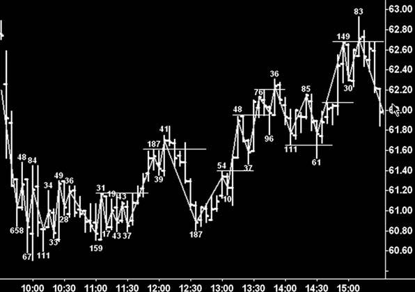

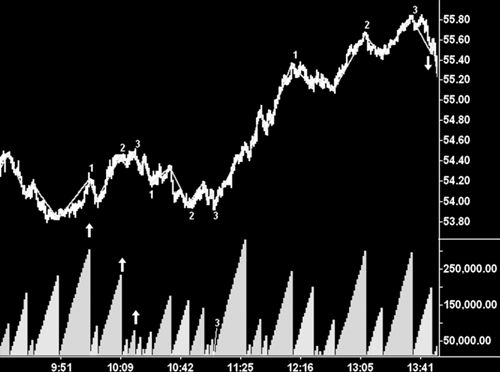

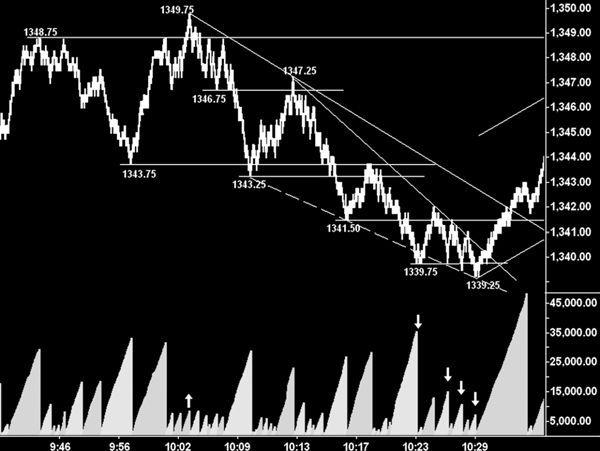

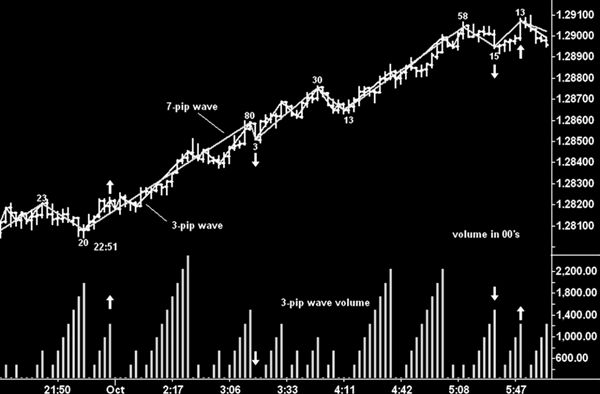

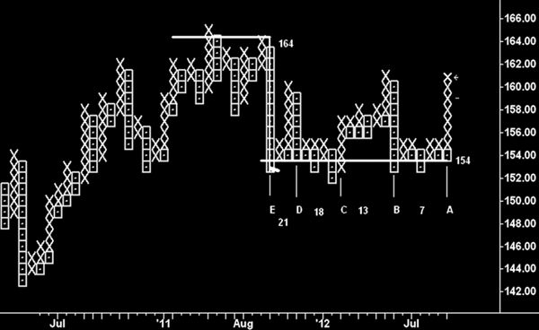

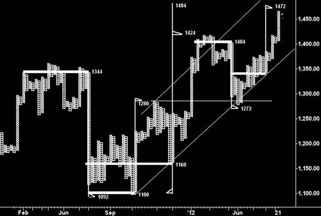

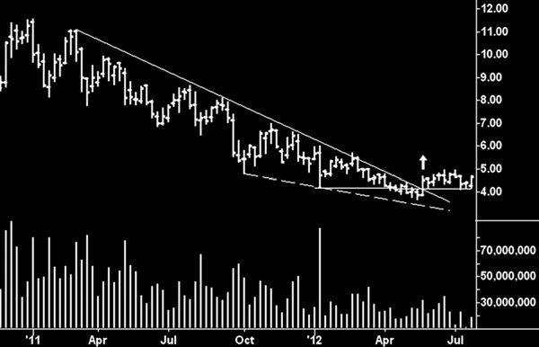

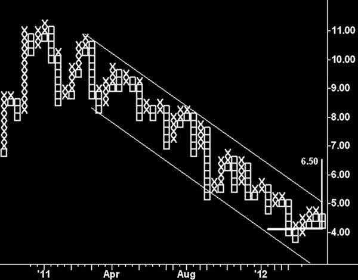

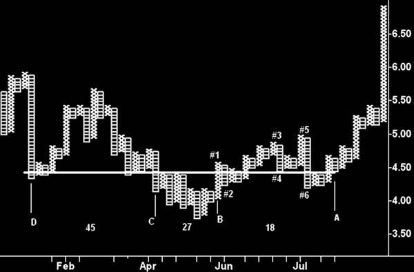

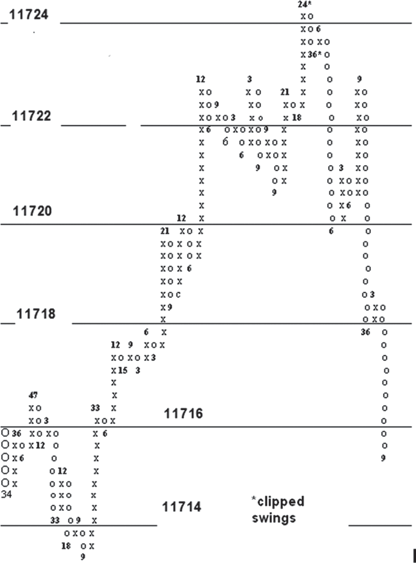

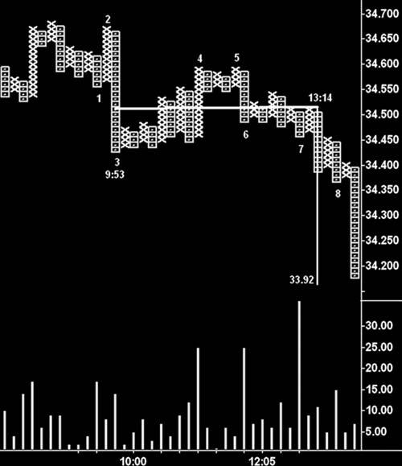

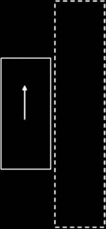

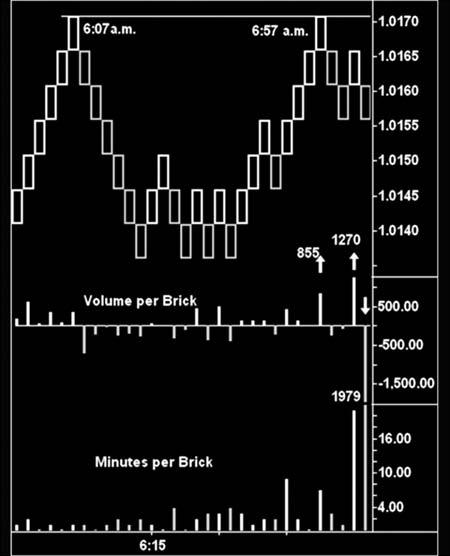

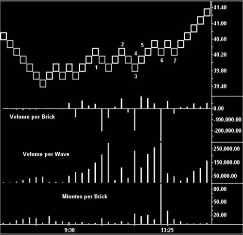

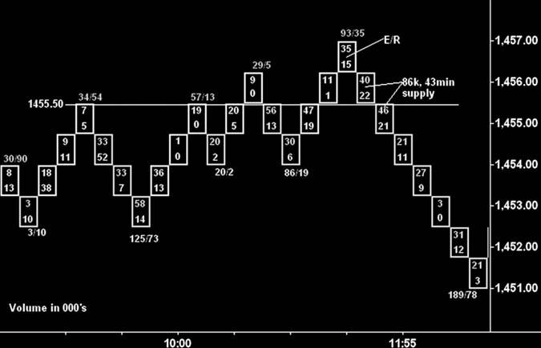

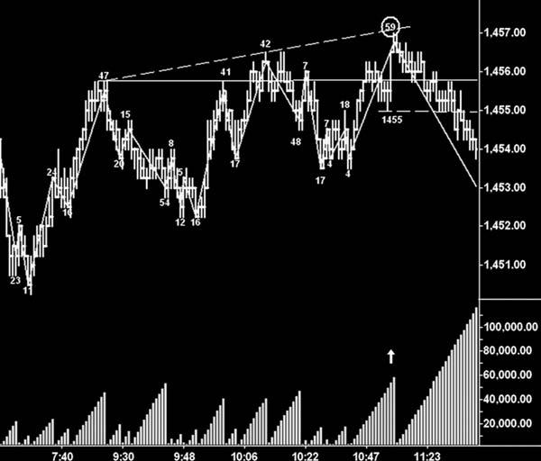

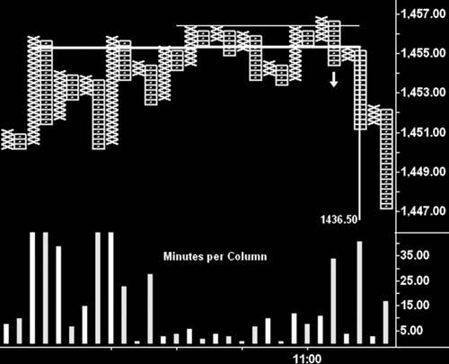

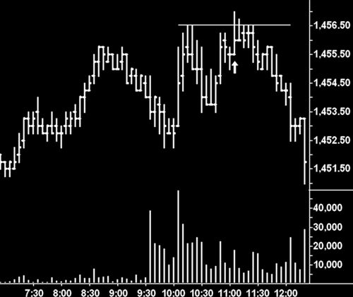

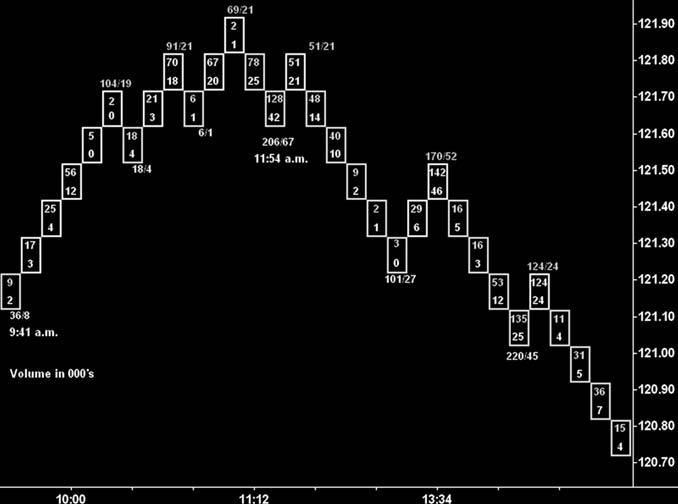

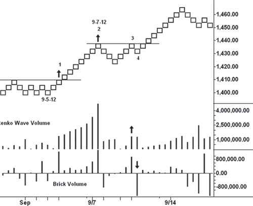

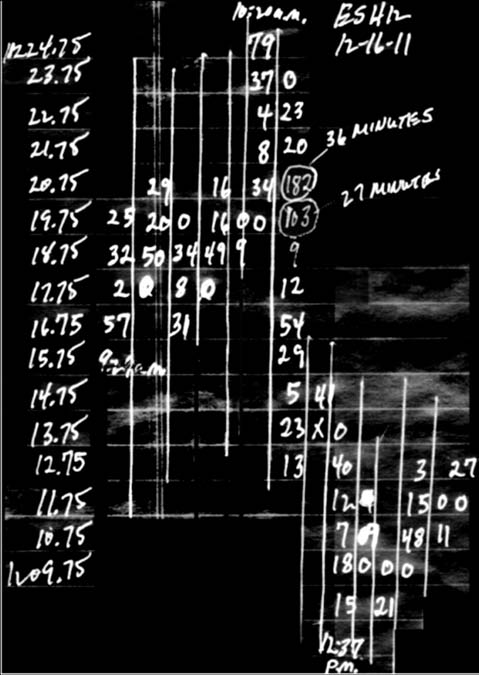

## See Also

- [[bar-chart-reading|Bar Chart Reading]]
## 🔗 Graph Connections

| Concept | Relation | Source |
|---|---|---|
| Candlestick Chart | Alternative To | EXTRACTED |
| Tape Reading | Used In | EXTRACTED |
