# Springs

> Sources: David Weis, 2013; Rubén Villahermosa Chaves, 2021
> Raw: [Trades About to Happen](../../raw/trading/2026-05-20-trades-about-to-happen.md); [Wyckoff 2.0 Structures](../../raw/trading/2026-05-20-wyckoff-2-structures.md)

## Overview

A spring is a washout (penetration) of a trading range or support level that fails to follow through and leads to an upward reversal. Weis considers trading springs one of the most reliable methods for finding trades across all timeframes. The concept originates from Wyckoff's observation that markets test and retest support levels to gauge supply and demand.

## Key Characteristics

- Price breaks below a well-defined support line but cannot sustain the decline
- The failure to follow through raises the possibility of a spring (not a guarantee — it is a "potential spring position")
- A true spring requires an upward reversal after the breakdown
- Springs can occur on any chart regardless of time period

## Success Factors

1. **Underlying trend** — Springs in an uptrend have a higher percentage of success. In a downtrend, a potential spring that fails gives useful information to short sellers.
2. **Volatility** — A market's volatility often dictates the size of the spring's upward reversal. More volatile markets produce larger spring reversals.
3. **Preparation** — The size of the trading range (congestion area) can determine the magnitude of the resulting up-move. Larger ranges create larger potential moves.

## How It Works (Wyckoff's View)

Large operators engineer sell-offs below support to test the existence of supply. If the breakdown fails to produce a flood of new selling, the operator recognizes a supply vacuum and buys aggressively, producing a fast reversal. The sell-off is often aided by stop-loss selling from trapped longs.

## Trading Springs

- Entry: when price shows clear upward reversal after the support break
- The risk point (stop) is near the extreme of the sell-off
- Ideal for both day traders (short-term pops) and position traders (long-term capital gains)

## Spring Confirmation with Order Flow (Villahermosa)

When a spring occurs at a key support zone, Order Flow analysis can confirm the reversal:

1. **Look for Selling Absorption** — the bearish candle shows high volume but price fails to follow through
2. **Watch for Initiative Buying** — the next candle shows aggressive buying attacking the ASK
3. **Delta Rotation** — delta swings from strongly negative to strongly positive
4. **Control + Test** — after the turning candle, price retests the high-volume zone and holds

The spring should also be evaluated with Volume Profile:
- Is the spring occurring at a LVN (potential rejection)?
- Is value area support nearby?
- Is the POC migrating upward after the spring?

## Figures from Trades About to Happen — Ch.5

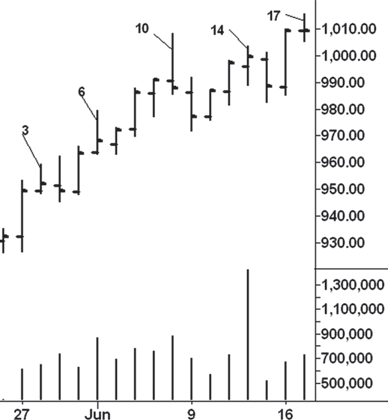

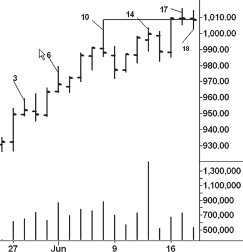

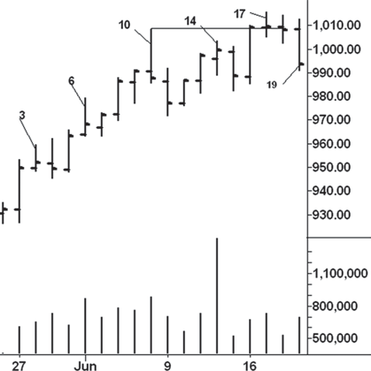

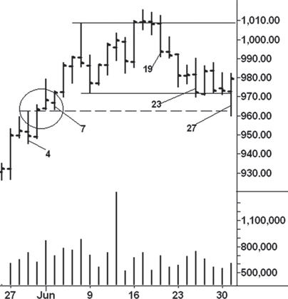

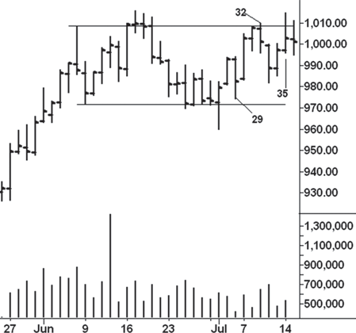

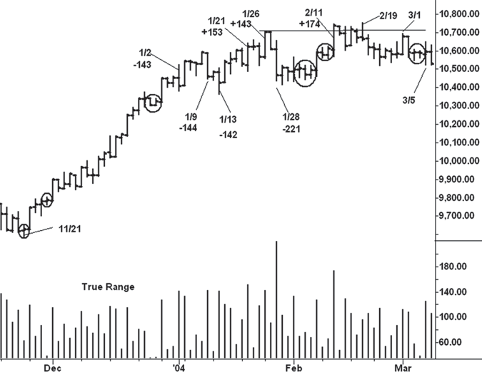

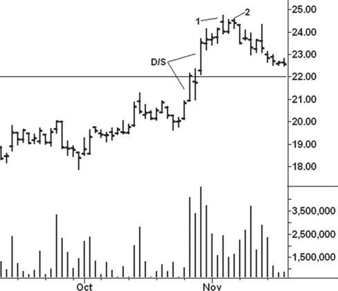

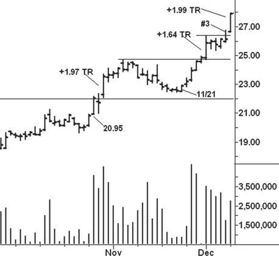

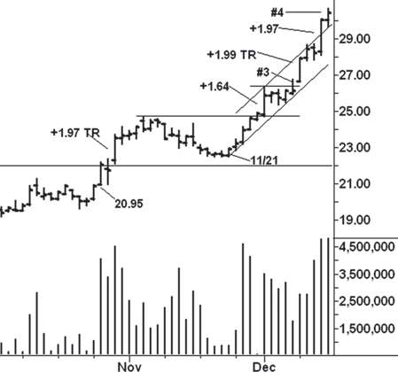

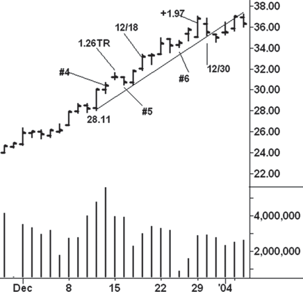

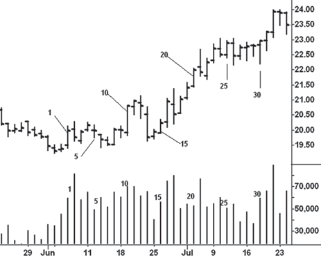

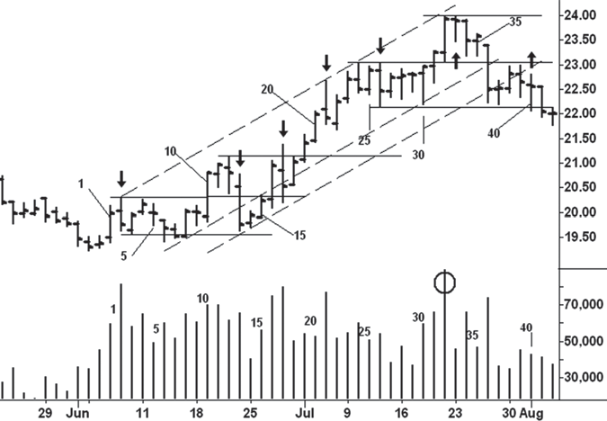

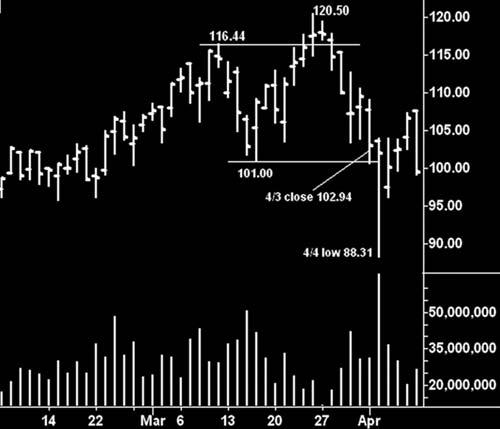

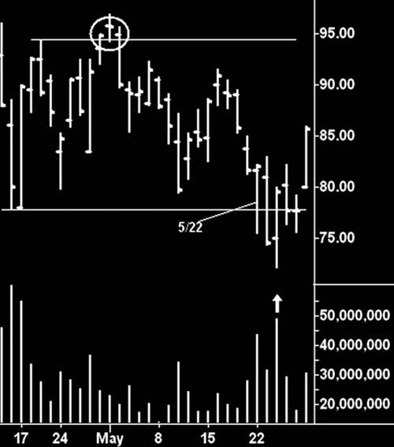

## Figures from Wyckoff 2.0 — Part 1

## Figures from A Complete Guide To Volume Price Analysis — Ch.4-5

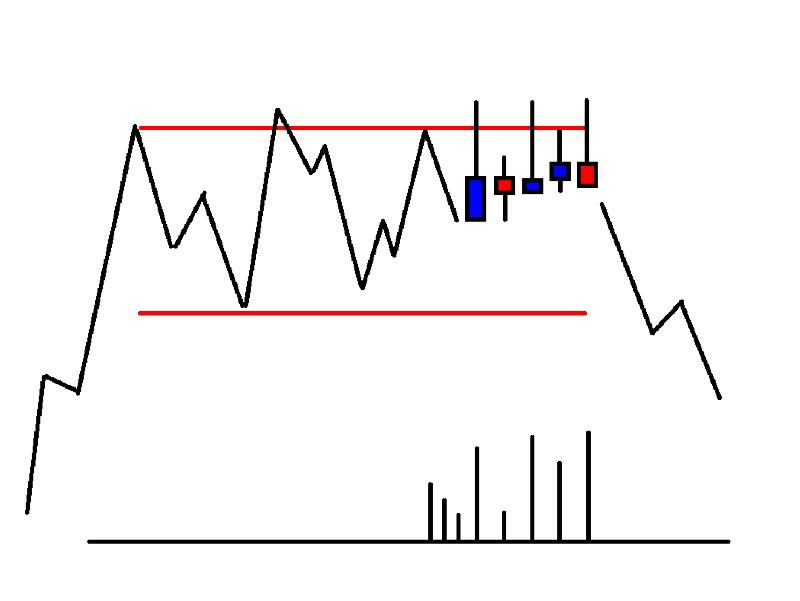

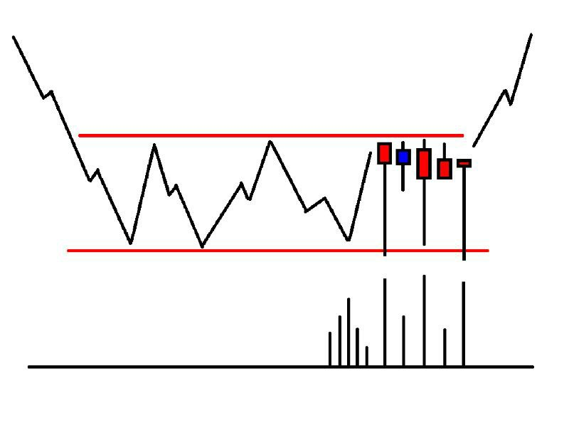

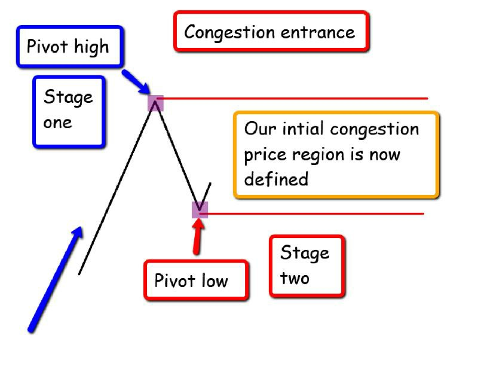

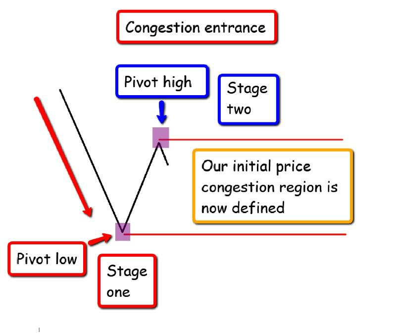

## See Also

- [Wyckoff Method Overview](wyckoff-method-overview.md)
- [Upthrusts](upthrusts.md)
- [Absorption](absorption.md)
- [Bar Chart Reading](bar-chart-reading.md)
- [Order Flow and Footprint](order-flow-footprint.md)
