# Tape Reading and the Weis Wave

> Sources: David Weis, 2013; Rubén Villahermosa Chaves, 2021
> Raw: [Trades About to Happen](../../raw/trading/2026-05-20-trades-about-to-happen.md); [Wyckoff 2.0 Structures](../../raw/trading/2026-05-20-wyckoff-2-structures.md)

## Overview

The second half of *Trades About to Happen* adapts Wyckoff's original tape-reading tools for modern markets. Central to this is the **Weis Wave**, a modification of Wyckoff's volume-figure chart that filters noise and highlights the volume on each buying and selling wave.

## Historical Context

Wyckoff's tape reading chart (volume-figure chart) plotted every transaction with volume numbers in a point-and-figure format. From this, he read the intraday flow of orders. The Weis Wave evolved from modifying this chart: increasing the minimum wave size to filter noise, and plotting volume as a histogram below price.

## The Weis Wave Construction

- Uses one-minute closing prices with volume
- A minimum wave size (e.g., 3/32nds for bonds) filters out micro-reactions
- When price reverses by the minimum amount, a new wave begins
- Volume is totalled per wave and plotted as a histogram
- The result: a clear picture of where the market encountered supply and demand

## Key Tape Reading Concepts

1. **Buying and selling waves** — markets move in waves, not equal time periods. Comparing the length, duration, and volume of consecutive waves reveals the dominant force.
2. **Shortening of thrust** — when the duration, size, and volume of buying waves diminish while selling waves grow, a trend change is near.
3. **Ease of movement** — a wave that makes rapid progress on moderate volume shows ease of movement in that direction.
4. **Stopping volume** — climactic volume that fails to produce further price movement signals exhaustion.
5. **Tests** — light-volume retests of a high-volume low (or high) confirm that the supply (or demand) has been absorbed.

## Practical Application

A tape reader goes through a mental checklist:
- How does the volume on this wave compare to previous waves?
- Is the upward (or downward) progress accelerating or decelerating?
- Is there follow-through after a support/resistance penetration?
- Where is price relative to trend lines and channels?

## Connection to Order Flow

The Weis Wave sits between standard bar charts and Order Flow analysis in terms of granularity:

| Tool | Data | Purpose |
|------|------|---------|
| Bar Chart | OHLCV per time period | Broad context |
| Weis Wave | Volume per price wave | Intermediate structure |
| Footprint | Volume per price level per bar | Micro-confirmation |

In the Wyckoff 2.0 framework, the Weis Wave and Order Flow complement each other: the Wave shows the macro-volume story, while the Footprint confirms the micro-turning points.

## Figures from Trades About to Happen — Ch.8-10

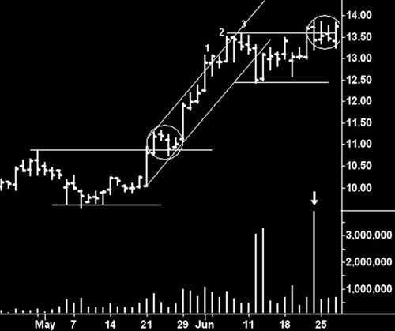

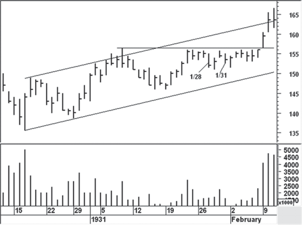

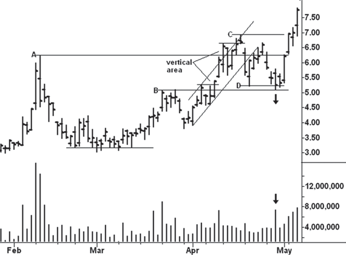

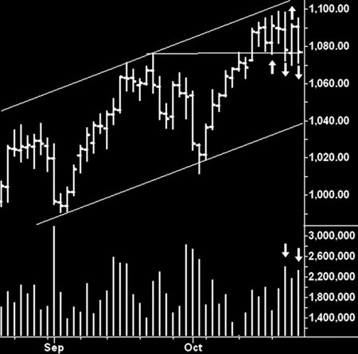

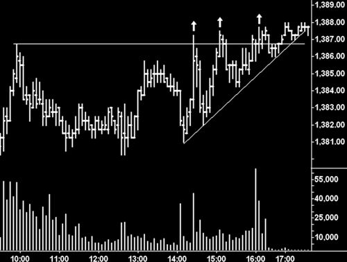

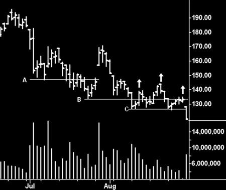

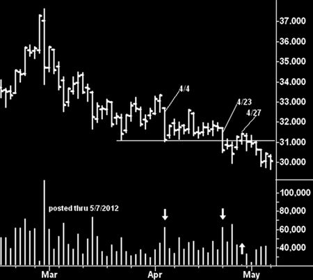

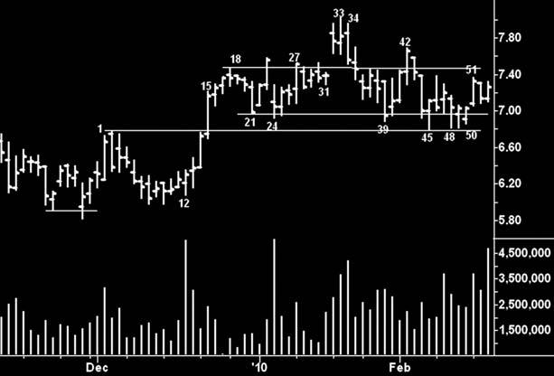

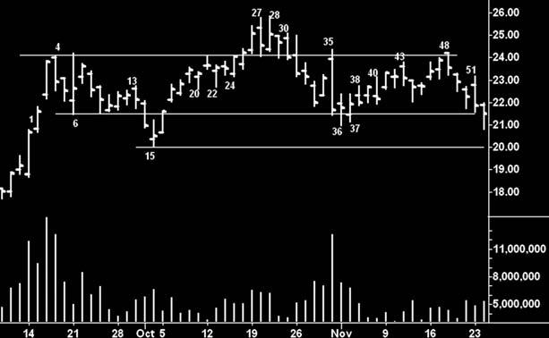

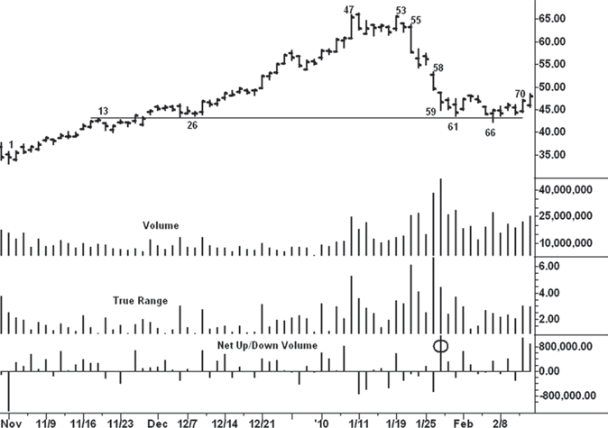

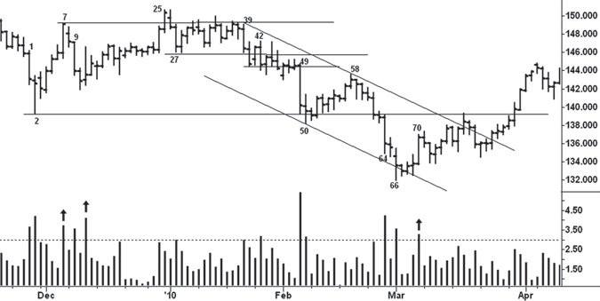

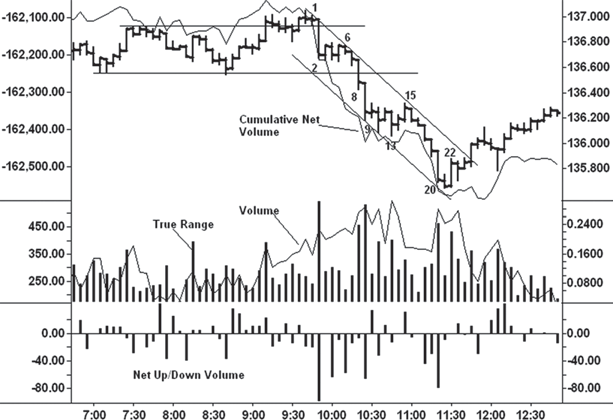

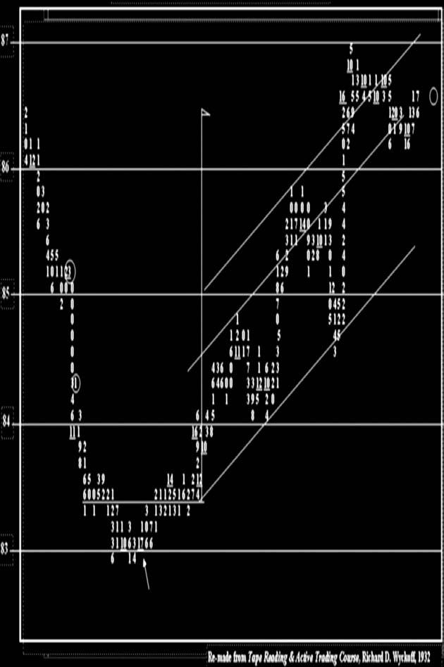

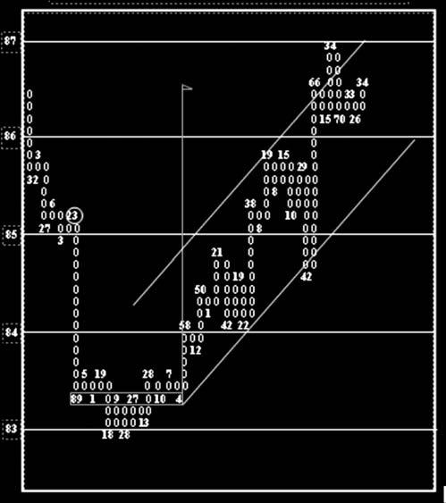

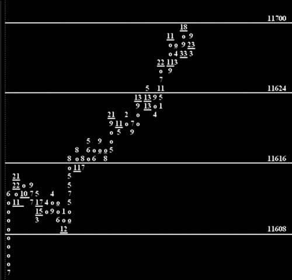

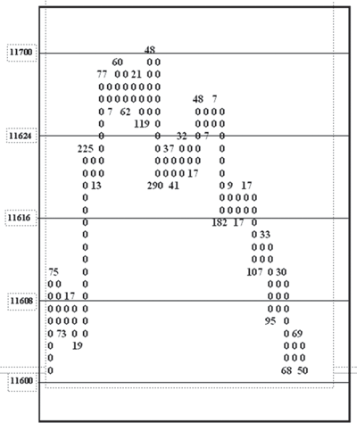

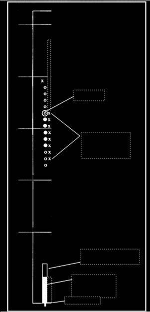

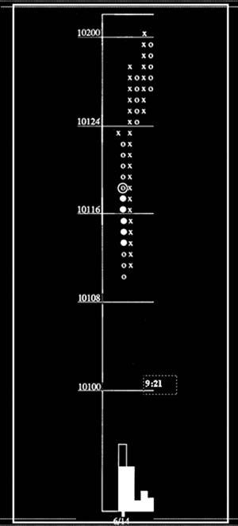

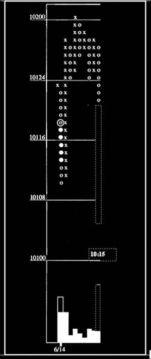

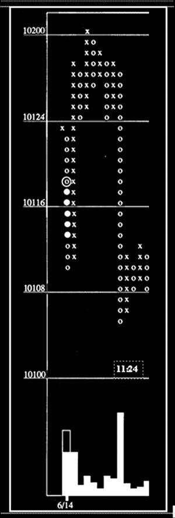

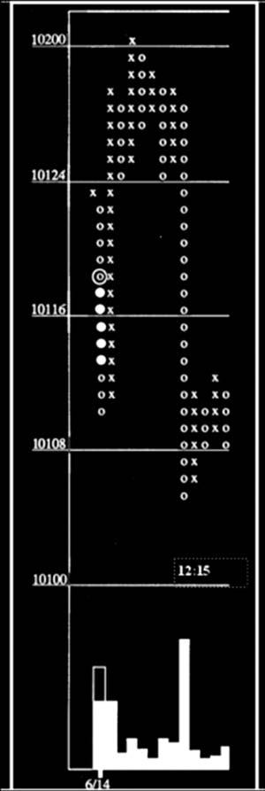

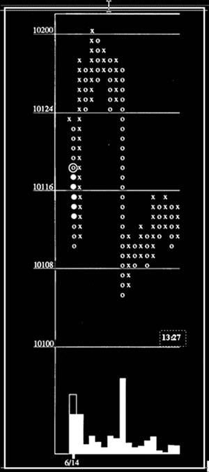

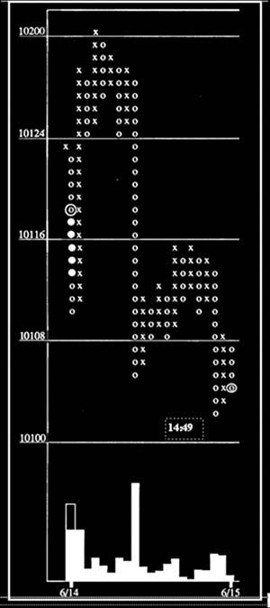

## See Also

- [Wyckoff Method Overview](wyckoff-method-overview.md)
- [Order Flow and Footprint](order-flow-footprint.md)
- [Bar Chart Reading](bar-chart-reading.md)
- [Springs](springs.md)
- [Upthrusts](upthrusts.md)
- [Volman Price Action Principles](../scalping_trading/volman-price-action-principles.md) — price action scalping principles (buildup, breaks, double pressure)
