# Trading Ranges, Support, and Resistance Lines

> Sources: David Weis, 2013; Anna Coulling, 2013
> Raw: [Trades About to Happen](../../raw/trading/trades-about-to-happen-2013.md); [A Complete Guide To Volume Price Analysis](../../raw/trading/a-complete-guide-to-volume-price-analysis-read-the-book-then-read-the-market-ann.md)

## Overview

Trades appear with greatest frequency around the edges of trading ranges. A trading range is a period of lateral price movement where buyers and sellers are in balance. The boundaries of these ranges are repeatedly tested and penetrated as the struggle for dominance unfolds.

## Characteristics of Trading Ranges

- Generally rectangular-shaped with prices swinging between upper and lower boundaries, or coiling into apexes
- Can evolve over months or years, often expanding boundaries and containing numerous sub-ranges
- After breakouts or breakdowns, prices often retest the broken boundary
- Behavior is consistent across all timeframes

## Drawing Lines

Support and resistance lines serve to frame the struggle between buyers and sellers:

- **Resistance lines** are drawn across swing highs where selling overcomes buying
- **Support lines** are drawn across swing lows where buying overcomes selling
- Lines dramatize failures: when price fails at a line, that failure is information
- **Axis lines** — horizontal lines around which prices revolve — are particularly informative on daily charts

## Line Selection

Choosing which highs and lows to connect is not mechanical. The lines should highlight the story within the trading range. In retrospect, the trader selects the points that best frame the relevant behavior. Lines may need to be redrawn as price movement evolves.

## Key Insight

The interaction of price with previously drawn lines is more significant than the lines themselves. A resistance line that has been tested multiple times and then cleanly broken tells a different story than one that is broken only to see price immediately fall back inside the range.

## Support and Resistance with Volume (Coulling)

Volume validates whether a support or resistance level is genuine:

- **Support test on low volume** — sellers are absent; the level is likely to hold
- **Support test on high volume** — heavy selling is being absorbed; watch for a breakdown or a buying climax reversal
- **Resistance test on low volume** — buyers are absent; the level is likely to hold
- **Resistance test on high volume** — heavy buying is being absorbed; watch for a breakout or a selling climax reversal

A breakout becomes significant only when confirmed by expanding volume. A breakout on declining volume is a potential trap (upthrust or spring).

### Congestion Phases

Markets move through congestion phases where support and resistance are being established. During congestion, volume often contracts as the market searches for equilibrium. The breakout from congestion must be on rising volume to be valid. A false breakout (low volume penetration that reverses) signals that the congestion phase continues.

## Dynamic Trend Lines (Coulling)

Traditional trend lines are drawn after the fact and often lag. Coulling introduces dynamic trend lines derived from volume analysis:

- **Volume-weighted trend lines** — connect points of high-volume rejection (where volume spiked and price reversed), not arbitrary swing points
- These reveal where the "smart money" has drawn its own lines in the market
- A break of a dynamic volume trend line is more significant than a break of a traditional line because it represents a shift in institutional participation

### Constructing Dynamic Trend Lines

1. Identify significant volume spikes where price reversed or stalled
2. Connect these spikes — they represent levels where large participants acted
3. The resulting line reflects the true structural boundary, not noise

These lines often precede traditional chart-based trend lines by several bars, giving the VPA trader an earlier entry.

## Congestion Patterns (Coulling)

Coulling identifies several high-probability congestion patterns that, when combined with volume, provide clear trading opportunities:

### Broadening Top / Broadening Bottom

Price makes wider swings while volume declines. The pattern resolves when volume expands sharply on a breakout/breakdown.

### Triangle Congestion

Price coils into a narrowing range. Volume should contract during the coiling and expand on the breakout. A triangle that breaks on low volume is a trap.

### Rectangle Congestion

Price oscillates between parallel support and resistance. The most reliable trades come when volume confirms the extreme: high-volume rejection at support, high-volume rejection at resistance.

### Flag / Pennant

Brief counter-trend congestion after a sharp move. Volume should contract during the flag/pennant and expand on the continuation breakout.

## Figures from A Complete Guide To Volume Price Analysis — Ch.7-8, 11

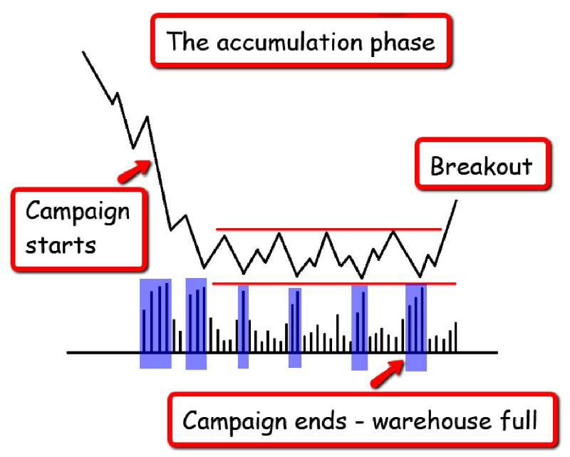

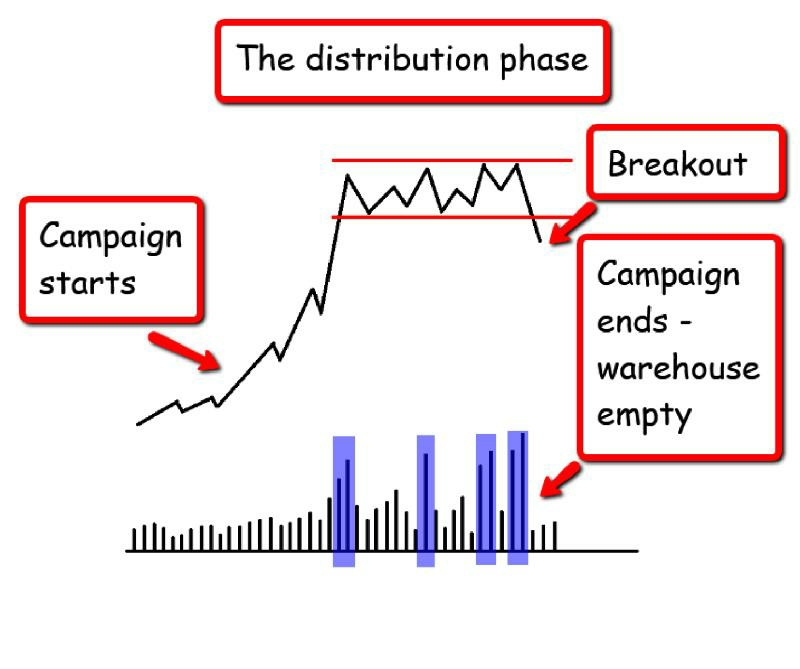

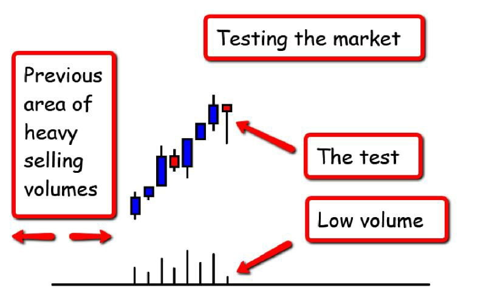

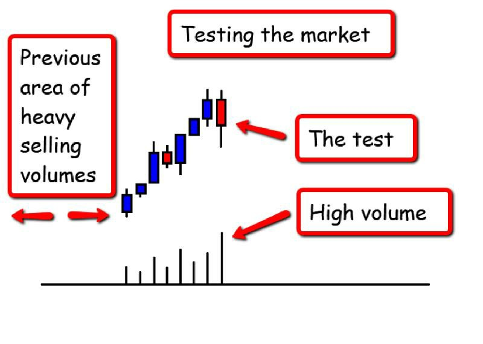

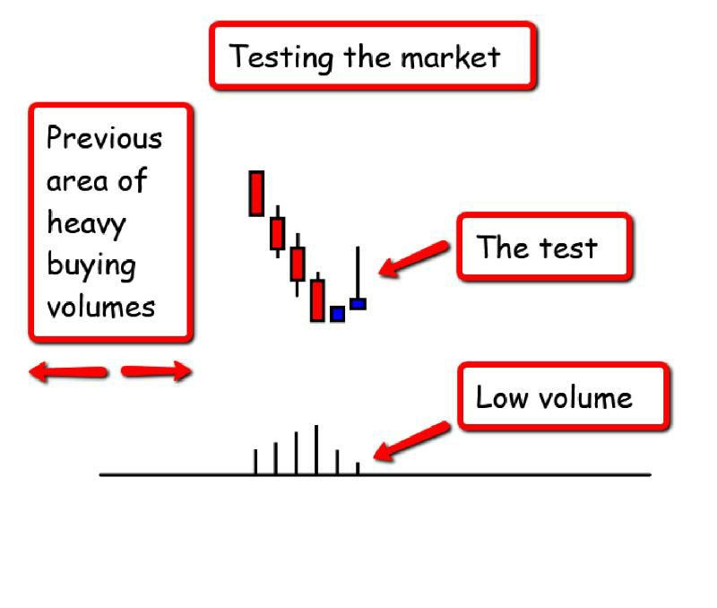

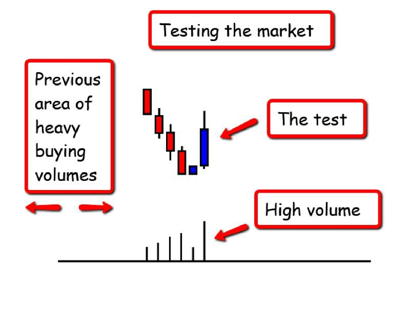

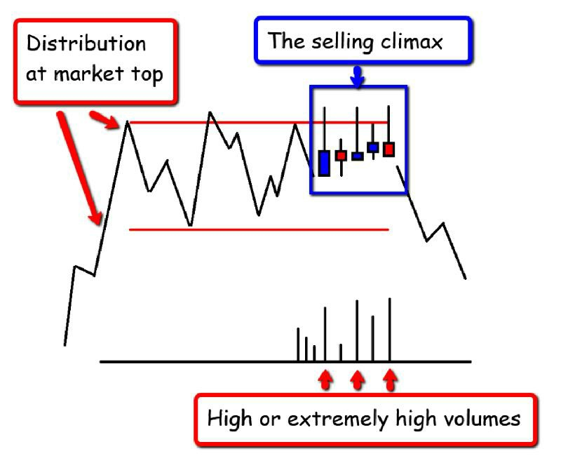

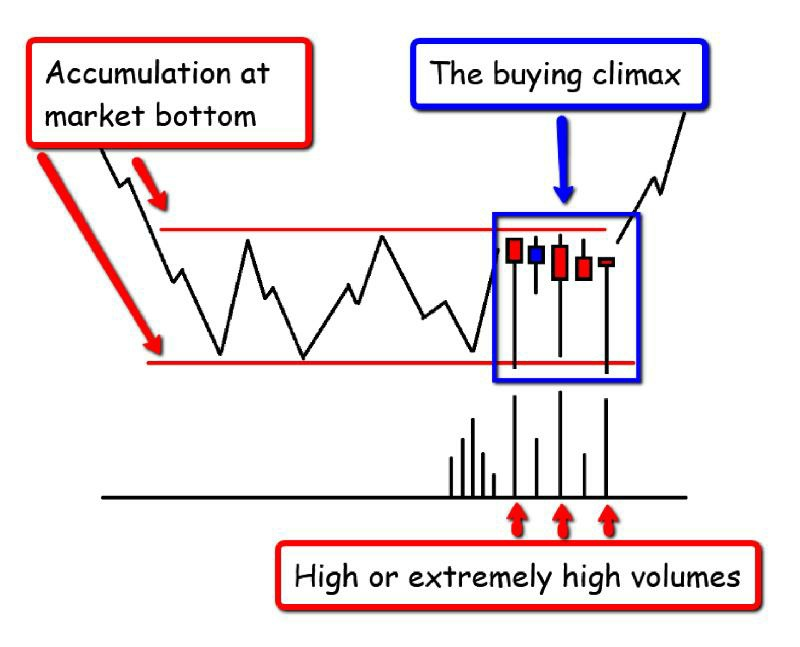

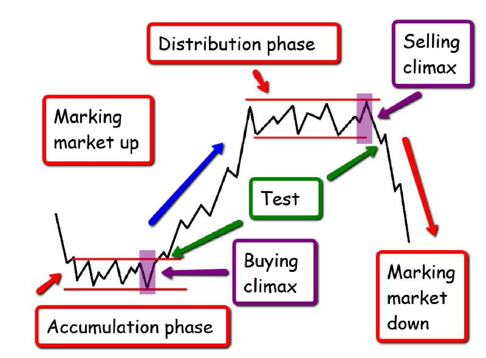

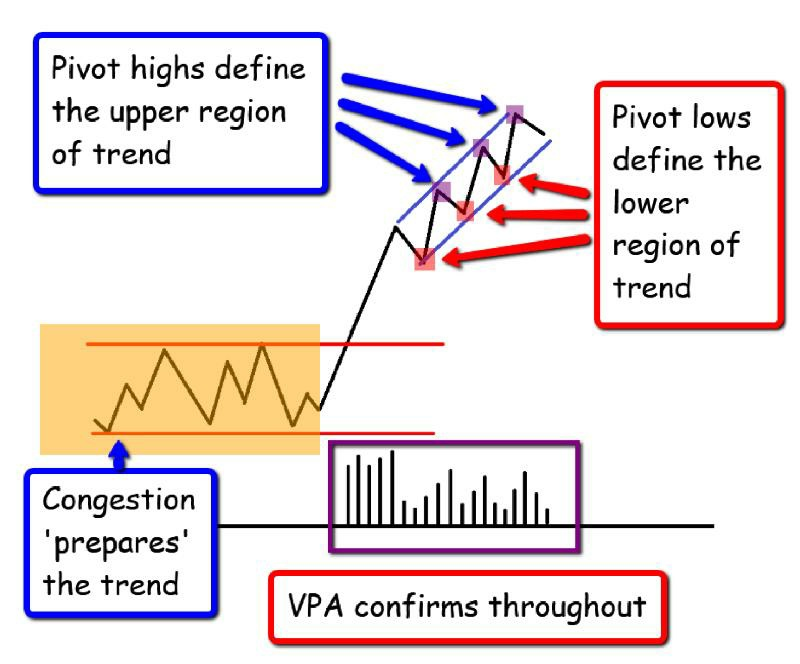

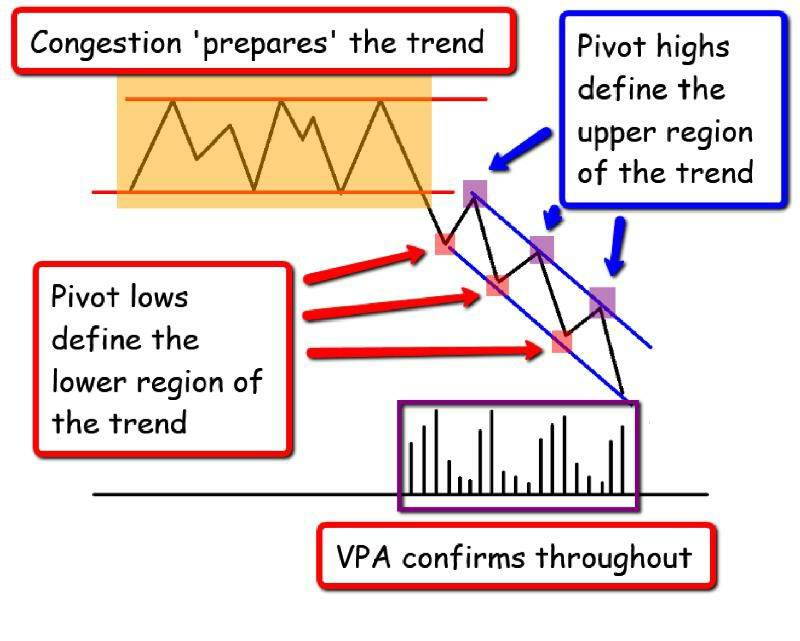

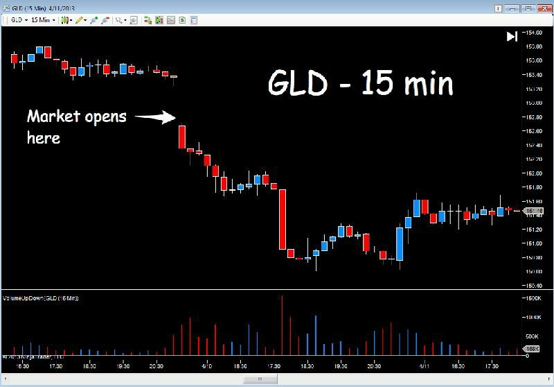

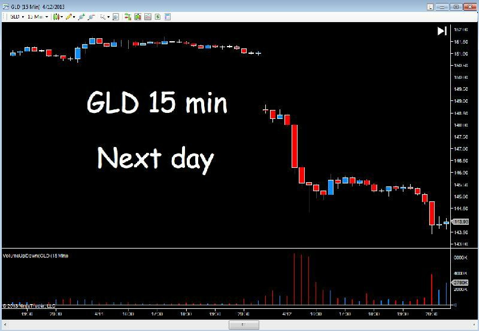

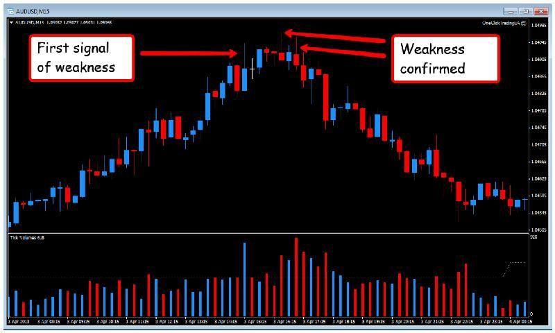

## Figures from Trades About to Happen — Ch.1-2

## Figures from Wyckoff 2.0 — Part 1

## See Also

- [Wyckoff Method Overview](wyckoff-method-overview.md)
- [Bar Chart Reading](bar-chart-reading.md)
- [Springs](springs.md)
- [Upthrusts](upthrusts.md)
- [Volume Price Analysis (VPA)](volume-price-analysis-vpa.md)
- [Volume at Price (VAP)](volume-at-price-vap.md)
## 🔗 Graph Connections

| Concept | Relation | Source |
|---|---|---|
| Apex | Variant Of | EXTRACTED |
| Creek | Conceptually Related To | EXTRACTED |
| Double Top / Double Bottom | Conceptually Related To | EXTRACTED |
| Price Action | Defines | EXTRACTED |
| Spring | Occurs At | EXTRACTED |
| Strong Rejection | Conceptually Related To | EXTRACTED |
| Support and Resistance | Defined By | EXTRACTED |
| Technical Test | Conceptually Related To | EXTRACTED |
| Trading Range | Defined By | EXTRACTED |
| Upthrust | Occurs At | EXTRACTED |

### Related Images

