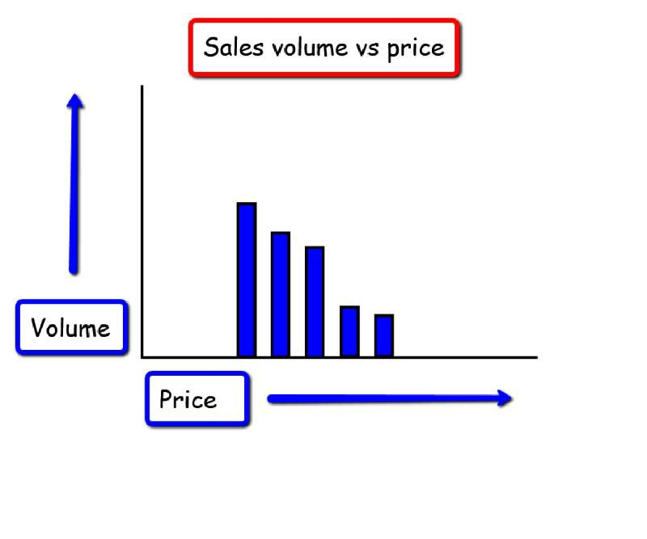
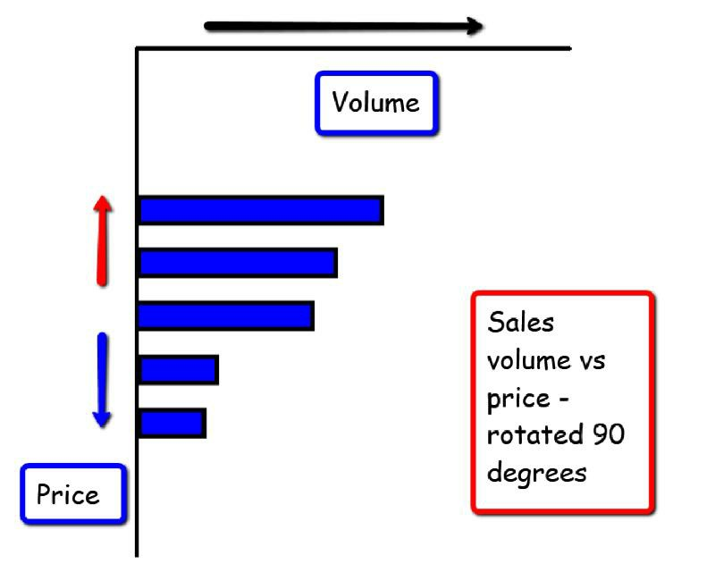
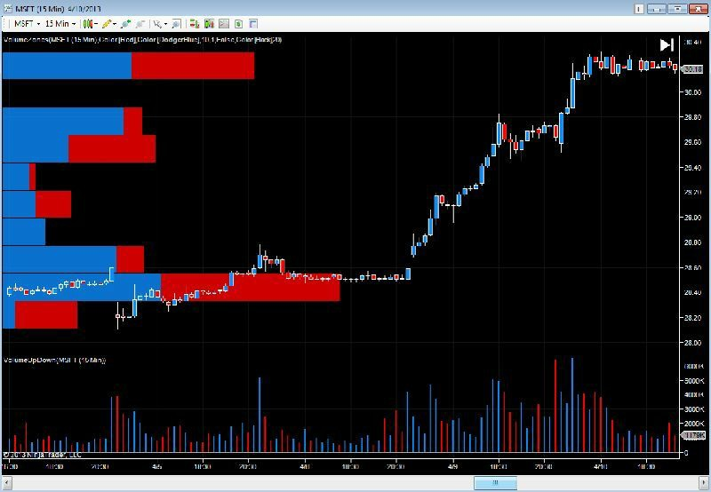
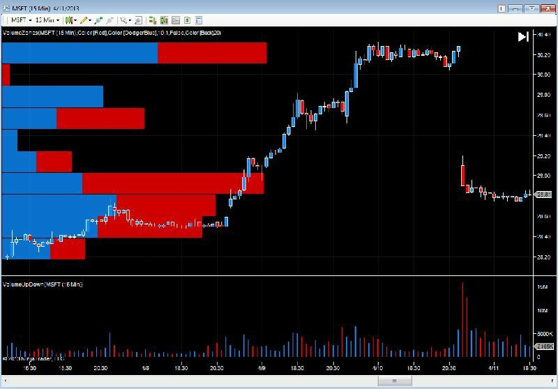
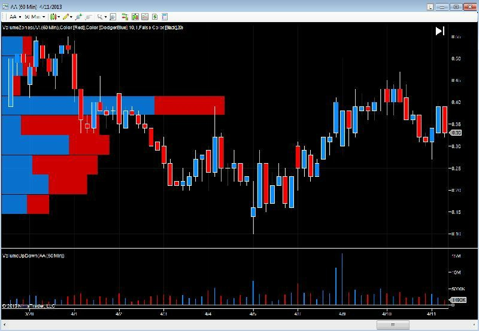
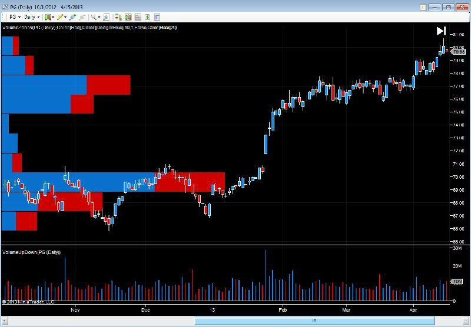
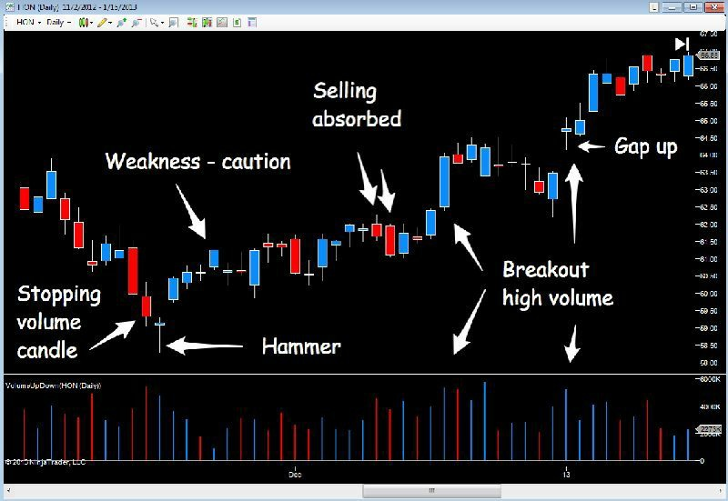
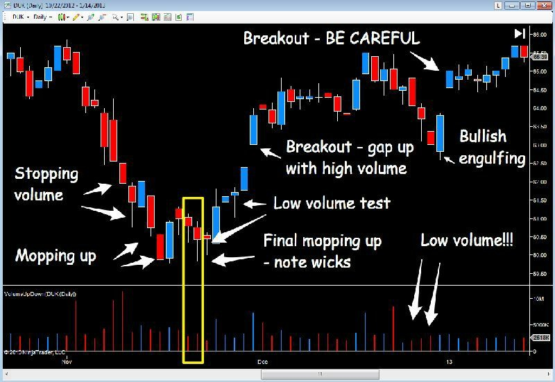
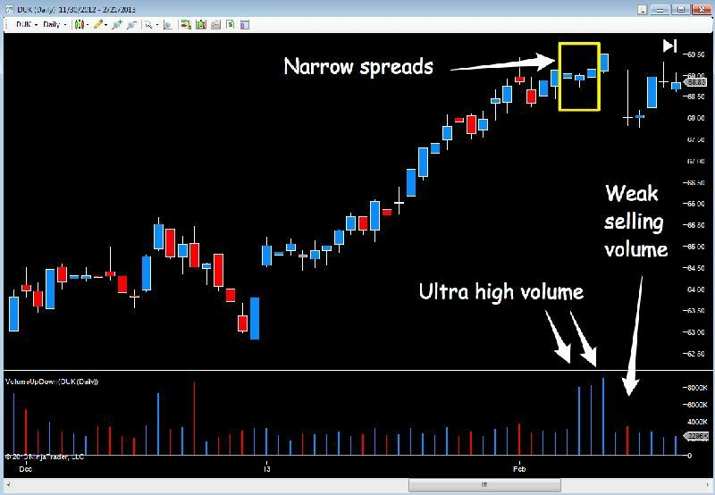
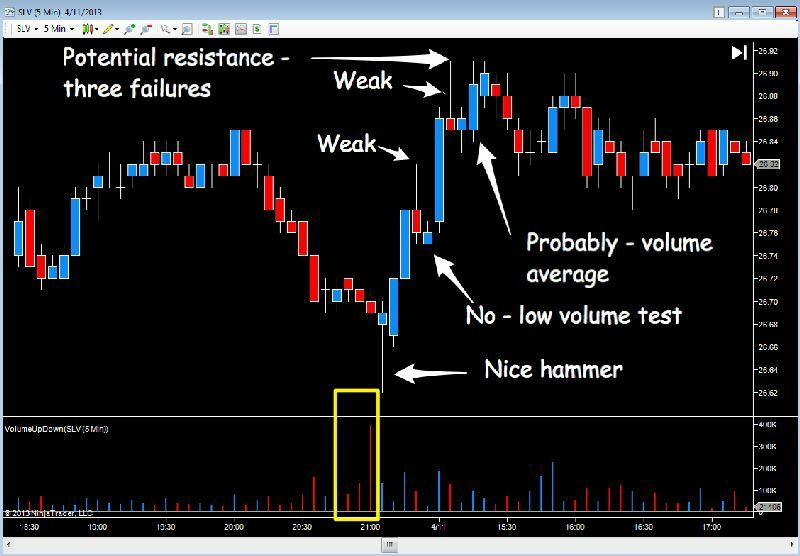

# Volume at Price (VAP)

> Sources: Anna Coulling, 2013
> Raw: [A Complete Guide To Volume Price Analysis](../../raw/trading/2026-05-20-volume-price-analysis.md)

## Overview

Volume at Price (VAP) is a horizontal volume analysis technique that shows the density of volume at each price level within a bar or session. While standard Volume Price Analysis (VPA) examines the total volume of a price bar after it closes, VAP looks inside the bar to reveal *where* within the price range the volume was concentrated.

VAP is a simpler, more visual precursor to Volume Profile. Both techniques analyse horizontal volume, but VAP focuses on individual price bars rather than session-wide profiles.

## The Concept

Standard volume bars show total volume for a time period. They do not reveal which price levels within that period saw the most trading. VAP solves this by plotting volume horizontally alongside price, showing the distribution of trades at each price tick.

Think of a wholesaler testing prices: raise the price, measure sales volume; lower the price, measure again. The result is a map of volume against price. VAP rotates this map 90 degrees and places it on the chart as a horizontal histogram beside each price bar.

## VPA vs. VAP

| Aspect | VPA | VAP |
|--------|-----|-----|
| Perspective | Outside the candle | Inside the candle |
| Data | Total volume per bar | Volume per price level per bar |
| Question | Does volume confirm the move? | Where is volume concentrated? |
| Output | Vertical volume histogram | Horizontal volume readout |

Together, VPA and VAP triangulate the volume picture from two angles.

## Practical Application

VAP reveals:

- **High-volume price levels** — where the most trading occurred within a bar. These act as support/resistance for subsequent price action.
- **Low-volume gaps** — price levels with minimal trading. Price tends to move through these quickly (potential breakout zones).
- **Volume concentration shifts** — when VAP shows volume moving from one price level to another, it reveals where interest is shifting.

### Trading with VAP

1. **Breakout confirmation** — a breakout from a high-volume VAP zone on expanding volume is genuine
2. **Reversal zones** — price reaching a previous high-volume VAP level with declining volume suggests exhaustion
3. **Congestion identification** — multiple bars with VAP clustered at the same price level reveal a congestion zone being built

## VAP and Volume Profile

VAP and Volume Profile both analyse horizontal volume, but differ in scope:

- **VAP** (Coulling) — volume per price level within a single bar. Simpler, bar-by-bar view.
- **Volume Profile** (Steidlmayer/Villahermosa) — volume per price level across a session or multi-bar period. Includes value area, POC, HVN/LVN.

VAP is useful for quick visual assessment of individual bars. Volume Profile provides a more comprehensive structural analysis.

## Figures from A Complete Guide To Volume Price Analysis — Ch.9

## See Also

- [Volume Price Analysis (VPA)](volume-price-analysis-vpa.md)
- [Volume Profile](volume-profile.md)
- [Order Flow and Footprint](order-flow-footprint.md)
- [Auction Market Theory](auction-market-theory.md)
- [Trading Ranges and Lines](trading-ranges-support-resistance.md)
