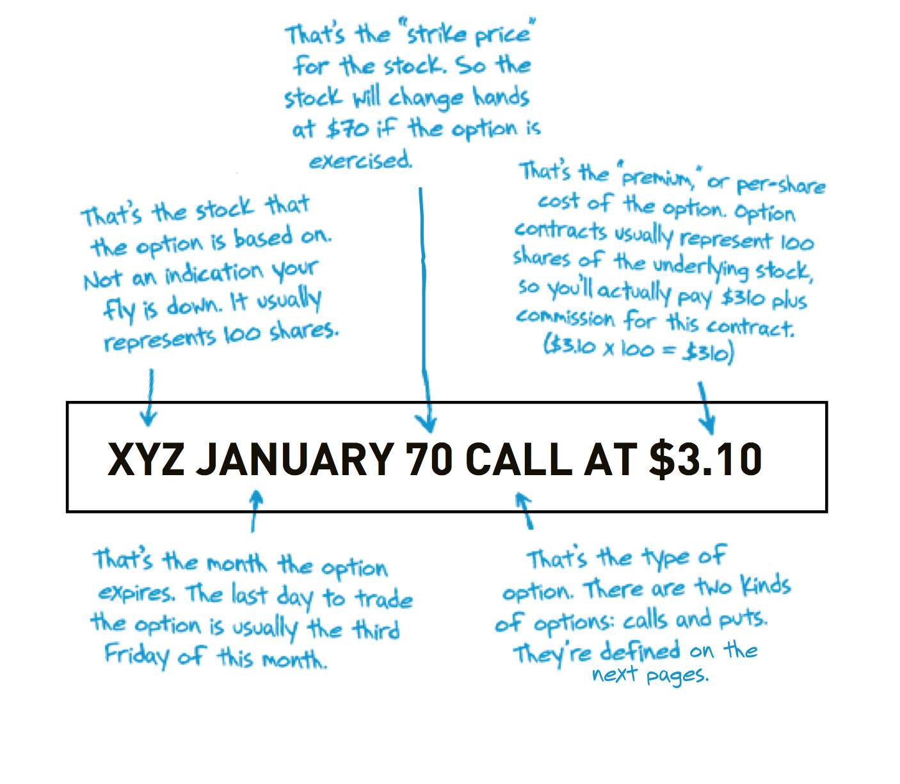

> Sources: Brian Overby, The Options Playbook; George Fontanills, The Options Course Workbook; Mark Elder & Brian Douglas, Options Trading Crash Course
> Raw: [Options Playbook](../../raw/options/the-options-playbook-expanded-2nd-edition-featuring-40-strategies-for-bulls-bear.md); [Options Course Workbook](../../raw/options/the-options-course-workbook-step-by-step-exercises-and-tests-to-help-you-master-.md); [Options Crash Course](../../raw/options/options-trading-crash-course-advanced-guide-to-make-money-with-options-trading-i.md)

## What Is an Option

An option is a contract giving the owner the right, but not the obligation, to buy or sell an asset at a fixed price (the strike price) for a specific period of time. The seller (writer) of the option has the obligation to take the opposite side if the owner exercises.

There are two flavors: **calls** and **puts**. A call gives the right to buy the underlying; a put gives the right to sell. A buyer (long) pays a premium for these rights; a seller (short) collects the premium and assumes the obligation.

## Option Contract Specifications

Each standardized stock option contract represents **100 shares** of the underlying stock. The key specifications are:

- **Underlying**: the stock, ETF, or index the option is based on
- **Strike price**: the pre-agreed price per share at which the stock may be bought (call) or sold (put)
- **Expiration date**: the last day the option can be exercised (Saturday following the third Friday of the expiration month for equity options)
- **Contract size**: 100 shares per contract (standard equity options)
- **Premium**: the price paid by the buyer to the seller for the option

The option symbol encodes five components: underlying ticker, expiration month/year, strike price, and call/put indicator.

## Moneyness

Moneyness describes the relationship between the strike price and the current price of the underlying.

| Moneyness | Call | Put |
|-----------|------|-----|
| **In-the-money (ITM)** | Stock price above strike | Stock price below strike |
| **At-the-money (ATM)** | Stock price = strike (nearest strike) | Stock price = strike |
| **Out-of-the-money (OTM)** | Stock price below strike | Stock price above strike |

ITM options have intrinsic value. ATM and OTM options consist entirely of time value.

## Intrinsic Value vs Time Value

An option's total premium breaks into two components:

**Intrinsic value** = the amount the option is in-the-money:
- Call: max(0, underlying price - strike price)
- Put: max(0, strike price - underlying price)

Only ITM options have intrinsic value. At expiration, an option is worth only its intrinsic value.

**Time value (extrinsic value)** = premium - intrinsic value. This reflects the probability the option will become ITM before expiration. ATM options have the most time value since uncertainty is highest. Time value decays to zero at expiration, which is why options are called "wasting assets."

## Open Interest and Volume

**Volume** is the number of contracts traded during a given period (updated intraday). **Open interest (OI)** is the total number of outstanding (open) option contracts, posted the morning after each trading session by the Options Clearing Corporation (OCC).

High OI indicates liquidity — tighter bid-ask spreads and easier order fills. OI increases when more contracts are opened than closed. Unlike stocks (fixed shares outstanding), options have no limit on the number of contracts — supply matches demand.

Key distinction: volume tells you what happened today; OI tells you how many positions are still active. Neither is inherently bullish or bearish — every buyer has a seller with an opposing view.

## Option Chains

An option chain lists all available options for an underlying, organized by expiration and strike price. Each row shows: option symbol, bid price, ask price, last price, volume, open interest, and implied volatility. The bid-ask spread narrows for liquid, high-OI contracts. Calls are typically listed on one side, puts on the other.

## Exercise and Assignment

**Exercise** occurs when the option buyer invokes the right to buy (call) or sell (put) the underlying at the strike price. **Assignment** is the corresponding obligation of the seller.

- **American-style options**: can be exercised at any time before expiration (standard for equity options)
- **European-style options**: can only be exercised at expiration (common for index options)
- **Automatic exercise**: OCC automatically exercises options that are $0.01+ ITM at expiration

Equity options settle by delivering shares; index options settle in cash. Early exercise is rare for calls (you lose time value) but can occur when a deep ITM put has little time value and the holder wants to capture intrinsic value. Assignment risk means short option holders must remain prepared for obligation fulfillment.

Index options differ from equity options: they are typically European-style (no early exercise), cash-settled, and have an earlier last trading day (Thursday before expiration Friday).

## Covered vs Naked Positions

**Covered**: when owning (or shorting) the underlying stock offsets the option obligation. A covered call = long stock + short call. A cash-secured put = cash set aside to buy stock if assigned. Risk is limited to stock ownership risk.

**Naked (uncovered)**: selling an option without an offsetting stock position. A naked short call has theoretically unlimited risk (stock can rise infinitely). A naked short put has substantial but limited risk (stock can only fall to zero). Naked options are only suitable for advanced traders.

## See Also

- [[options-greeks|Options Greeks]] — delta, gamma, theta, vega, rho
- [[options-volatility|Options Volatility]] — implied volatility, volatility skew, VIX
- [[options-strategies|Options Strategies]] — vertical spreads, iron condors, straddles
- [[contrarian-sentiment-analysis|Contrarian Sentiment Analysis]] — put/call ratios, VIX sentiment
- [[volman-price-action-principles|Volman Price Action Principles]] — price action for options entries
- [[crypto-hype-analysis|Crypto Hype Analysis]] — sentiment analysis parallels
## 🔗 Graph Connections

| Concept | Relation | Source |
|---|---|---|
| Bear Put Spread | Strategy For | EXTRACTED |
| Bull Call Spread | Strategy For | EXTRACTED |
| Call Option | Contrasts With | EXTRACTED |
| Covered Call | Strategy For | EXTRACTED |
| Delta | Defines | EXTRACTED |
| Expiration Date | Defines | EXTRACTED |
| Iron Condor | Strategy For | EXTRACTED |
| LEAPS (Long-Term Equity Options) | Defines | EXTRACTED |
| Long Call | Strategy For | EXTRACTED |
| Long Put | Strategy For | EXTRACTED |
| Long Straddle | Strategy For | EXTRACTED |
| Long Strangle | Strategy For | EXTRACTED |
| Option Premium | Defines | EXTRACTED |
| Protective Put | Strategy For | EXTRACTED |
| Put Option | Contrasts With | EXTRACTED |
