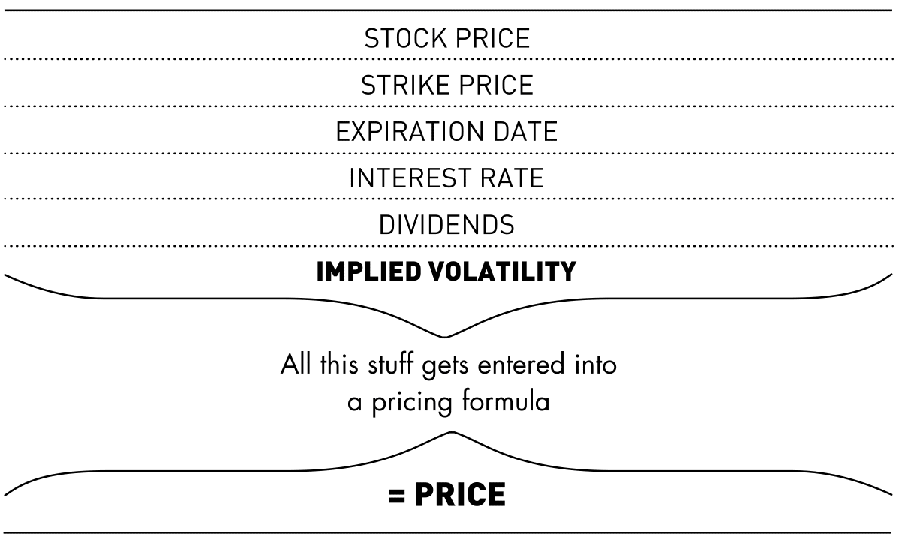
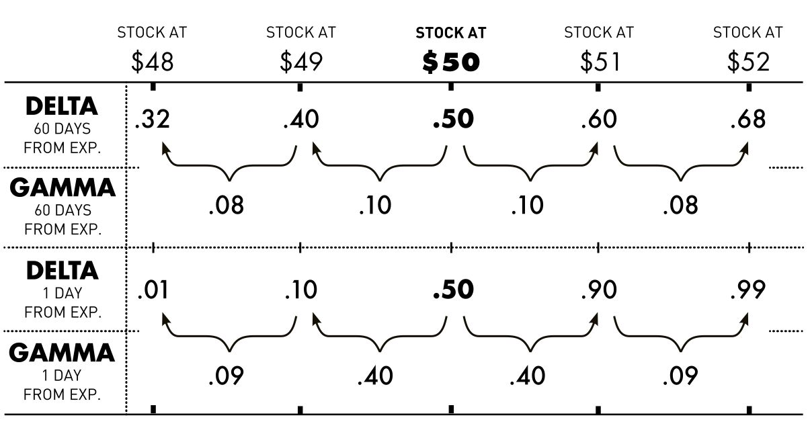
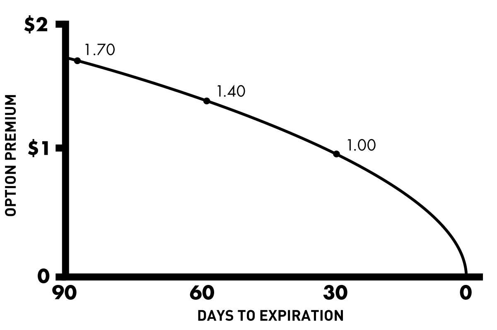
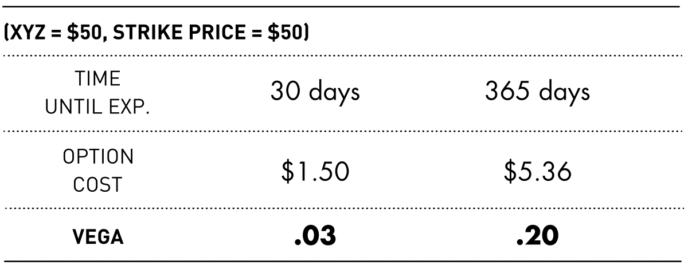

# Options Greeks

> Sources: Brian Overby, The Options Playbook; George Fontanills, The Options Course Workbook
> Raw: [Options Playbook](../../raw/options/2026-05-20-options-playbook.md); [Options Course Workbook](../../raw/options/2026-05-20-options-course-workbook.md)

## Overview

The Greeks are a set of risk measurements that quantify how an option's price responds to changes in the underlying stock price, time, volatility, and interest rates. They give traders a framework for understanding exposure and making adjustments. The four primary Greeks are delta, gamma, theta, and vega. A fifth, rho, is less relevant for short-term trading.

## Delta (Δ)

Delta measures the expected change in an option's price for a $1 move in the underlying stock. Calls have positive delta (0 to 1.00); puts have negative delta (0 to −1.00). In practice, traders drop the decimal: a 50-delta call moves $0.50 per $1 stock move.

**Delta ranges by moneyness:**

| Option Type | ITM | ATM | OTM |
|-------------|-----|-----|-----|
| Call | 0.50–1.00 | ~0.50 | 0.00–0.50 |
| Put | −0.50 to −1.00 | ~−0.50 | 0.00 to −0.50 |

Deep ITM options behave almost like stock (delta near 1.00 for calls, −1.00 for puts). Far OTM options have deltas near zero and barely react to stock moves.

### Delta as Probability

Delta is often interpreted as the approximate probability that the option will expire at least $0.01 ITM. An ATM 50-delta call has roughly a 50% chance of finishing ITM. As the stock rises, so does delta — reflecting increased probability. This is not the mathematical definition (delta is the derivative of price with respect to the underlying), but it is a useful heuristic.

### How Delta Changes

**Stock price movement:** As a call moves deeper ITM, delta approaches 1.00. As it moves OTM, delta approaches 0. The same dynamic applies in reverse for puts.

**Time to expiration:** Near expiration, ITM options approach a delta of ±1.00 while OTM options collapse toward 0. An ATM call one day from expiration still has roughly 50 delta, but a one-point move in the stock can swing delta dramatically — to ~90 if the stock moves ITM, or ~10 if it moves OTM.

### Position Delta

Position delta sums the deltas of all legs in a multi-leg trade. 100 shares of long stock = +100 deltas; short stock = −100 deltas. Delta neutral means total position delta is near zero — the trade is insensitive to small moves in the underlying. This is the foundation of delta neutral trading.

## Gamma (Γ)

Gamma measures the rate of change in delta for a $1 move in the underlying — the "acceleration" of the option's price. High gamma means delta changes rapidly, making the option more responsive.

**Key properties:**
- ATM options have the highest gamma, especially with short time to expiration
- Gamma is positive for long options (both calls and puts) and negative for short options
- Gamma decays as options move deeper ITM or further OTM

Near-term ATM options are the most "explosive" — a small stock move can produce a large change in delta, which in turn produces a larger price change. This cuts both ways: if the stock moves in your favor, delta accelerates toward 1.00; against you, it accelerates toward 0.

## Theta (Θ)

Theta measures the daily time decay of an option's price — the rate at which time value erodes. Theta is always negative for long options (time works against the buyer) and positive for short options (time works for the seller).

**Accelerating decay:** Time decay is not linear. It accelerates sharply in the final 30–60 days before expiration. A 90-day ATM option might lose $0.30 of time value in month one, $0.40 in month two, and the remaining $1.00 in the final month. This is why many option buyers prefer 90+ days until expiration, and sellers target the last 30–45 days.

ATM options have the most time value and therefore the most theta risk. OTM options have less dollar decay but can lose a higher percentage of their value each day. ITM options have the least time value (most of the premium is intrinsic), so theta impact is minimal.

## Vega (ν)

Vega measures the change in an option's price for a one-point change in implied volatility. Vega affects only time value, not intrinsic value. Higher IV increases option premiums; lower IV decreases them.

**Key properties:**
- Vega is positive for long options, negative for short options
- Longer-term options have higher vega because they have more time value
- ATM options have the highest vega for a given expiration
- A 30-day ATM option might have vega of 0.03; a 365-day option might have vega of 0.20

Vega is critical around events like earnings. IV often rises beforehand (inflating premiums) and collapses after the announcement — the "volatility crush." A buyer who is right on direction can still lose money if the IV drop offsets the directional gain.

## Rho (ρ)

Rho measures the change in an option's price for a 1% change in interest rates. It is the least impactful Greek for short-term equity options. However, for long-term LEAPS options, rho can be significant due to the higher cost of carry over time.

## Black-Scholes and the Greeks

The Greeks are derived from option pricing models, most commonly Black-Scholes. The seven inputs to Black-Scholes are:

1. Current underlying price
2. Strike price
3. Option type (call/put)
4. Time to expiration
5. Risk-free interest rate
6. Volatility (implied)
7. Dividend rate of the underlying

Changes in these inputs produce changes in the Greeks, which together determine the option's theoretical price movement.

## See Also

- [Options Fundamentals](options-fundamentals.md) — contract specs, moneyness, intrinsic vs time value
- [Options Volatility](options-volatility.md) — implied volatility, volatility skew, VIX
- [Options Strategies](options-strategies.md) — applying Greeks to strategy selection
- [Contrarian Sentiment Analysis](../trading/contrarian-sentiment-analysis.md) — put/call ratios, VIX sentiment
- [Volman Price Action Principles](../scalping_trading/volman-price-action-principles.md) — price action for options entries
- [Crypto Hype Analysis](../crypto_trading/crypto-hype-analysis.md) — sentiment analysis parallels
