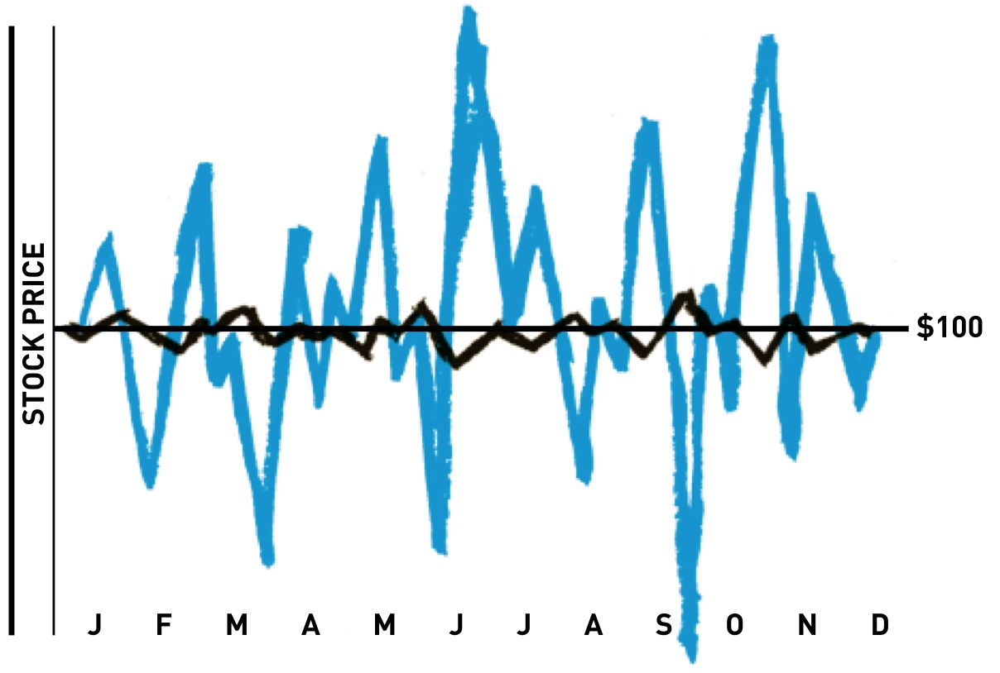
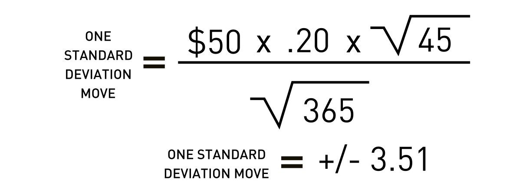

> Sources: Brian Overby, The Options Playbook; George Fontanills, The Options Course Workbook
> Raw: [Options Playbook](../../raw/options/the-options-playbook-expanded-2nd-edition-featuring-40-strategies-for-bulls-bear.md); [Options Course Workbook](../../raw/options/the-options-course-workbook-step-by-step-exercises-and-tests-to-help-you-master-.md)

## What Is Volatility

Volatility is the magnitude of price fluctuation in a security over a given period — it measures how much and how fast a stock price moves, without regard for direction. A stock can end a year at the same price it started yet still be highly volatile if it traded in a wide range along the way.

There are two main types relevant to option traders: **historical volatility** and **implied volatility**.

## Historical Volatility (HV)

Historical volatility (also called statistical volatility) measures past price movement. It is the annualized standard deviation of daily stock price changes, typically calculated over a 21–23 day window (one trading month). HV tells you how volatile the stock *was* — it is backward-looking and does not predict the future, but it provides a baseline for judging whether current option prices are rich or cheap.



## Implied Volatility (IV)

Implied volatility is forward-looking: it represents the market's consensus estimate of how volatile the stock will be in the future, derived from the current market prices of options. IV is calculated by plugging option prices into a pricing model (Black-Scholes for stocks, Black for futures) and solving for the volatility variable.

When option prices rise (due to demand, uncertainty, or upcoming events), IV rises. When option prices fall, IV falls. Unlike HV, IV can only exist because options exist — without an options market, there is no implied volatility.

**Key relationship:** All else equal, higher IV means higher option premiums; lower IV means cheaper options. IV impacts only time value, not intrinsic value.

### IV and Standard Deviation

IV is expressed as an annualized percentage. A stock at $50 with 20% IV implies a one standard deviation move of ±$10 over the next year — meaning the market expects a 68% probability the stock stays between $40 and $60 in 12 months.

For shorter time frames, a "quick and dirty" formula converts annual IV to the expected one standard deviation range over the option's remaining life:

```
1 SD move ≈ Stock Price × IV × √(days to expiration / 365)
```



This assumes a normal distribution for simplicity (pricing models use log-normal, where upside moves can exceed downside moves because stock prices cannot fall below zero).

## Volatility Skew and Smile

Volatility is not constant across strike prices. In equity options, OTM puts typically trade at higher IV than OTM calls — a pattern called **volatility skew**. This reflects market participants' greater demand for downside protection (crash risk). In indices, this is especially pronounced (the "smile" flattens into a skew after 1987).

Skew creates pricing discrepancies that traders can exploit: selling overpriced options (high IV) and buying underpriced ones (low IV), expecting mean reversion.

## The Volatility Crush

A **volatility crush** occurs when IV collapses after a known event (earnings, FDA decision, economic report) eliminates uncertainty. IV often rises in the weeks before the event, inflating option premiums, then drops sharply once the news is released — even if the stock moves in the expected direction.

An option buyer who is correct on direction can still lose money if the IV drop (vega loss) outweighs the directional gain. This is why buying options with elevated IV is risky and why many prefer to sell premium into high IV environments.

## Volatility Mean Reversion

IV tends to oscillate around an average level — it is "elastic," stretching high during fear and compressing low during complacency. This mean-reverting property enables strategies that sell premium when IV is high and buy when IV is low.

Traders use **IV rank** and **IV percentile** (comparing current IV to its historical range over a lookback period) to gauge whether options are relatively cheap or expensive.

## VIX and Sentiment

The CBOE Volatility Index (VIX) measures 30-day implied volatility of S&P 500 index (SPX) options. It is often called the "fear gauge." During market stress, demand for SPX puts surges and the VIX spikes. During calm periods, the VIX trends low.

**Contrarian use:** The VIX tends to stay within a range for months or years. When it exceeds that range (high VIX → pessimism), it can signal a market bottom; when it drops below (low VIX → complacency), it can signal a top.

Other sentiment tools include:
- **Put/call ratio:** Used as a contrarian indicator — when the crowd piles into puts, it can signal excessive bearishness (buying opportunity); when calls dominate, excessive bullishness may point to a top.
- **VXN:** The VIX equivalent for the NASDAQ-100 (QQQ options).

## Earnings and Events

Earnings announcements are predictable volatility events. IV typically rises into the announcement and collapses after — the "earnings crush." The options market prices in the expected move (often indicated by the ATM straddle price). If the actual move exceeds the expected move, long premium players profit; if it falls short, short premium players win.

## See Also

- [[options-fundamentals|Options Fundamentals]] — contract specs, moneyness, intrinsic vs time value
- [[options-greeks|Options Greeks]] — delta, gamma, theta, vega, rho
- [[options-strategies|Options Strategies]] — volatility-based strategies
- [[contrarian-sentiment-analysis|Contrarian Sentiment Analysis]] — put/call ratios, VIX sentiment
- [[volman-price-action-principles|Volman Price Action Principles]] — price action for options entries
- [[crypto-hype-analysis|Crypto Hype Analysis]] — sentiment analysis parallels
## 🔗 Graph Connections

| Concept | Relation | Source |
|---|---|---|
| Bid Ask Spread | Conceptually Related To | EXTRACTED |
| Black Scholes Model | Defines | EXTRACTED |
| Call Option | Defines | EXTRACTED |
| Historical Volatility | Contrasts With | EXTRACTED |
| Implied Volatility | Contrasts With | EXTRACTED |
| Implied Volatility | Defines | EXTRACTED |
| Intrinsic Value | Defines | EXTRACTED |
| Leverage | Conceptually Related To | EXTRACTED |
| Option Premium | Defines | EXTRACTED |
| Put Option | Defines | EXTRACTED |
| Rho | Defines | EXTRACTED |
| Standard Deviation | Conceptually Related To | EXTRACTED |
| Time Value | Defines | EXTRACTED |
| Vega | Defines | EXTRACTED |
